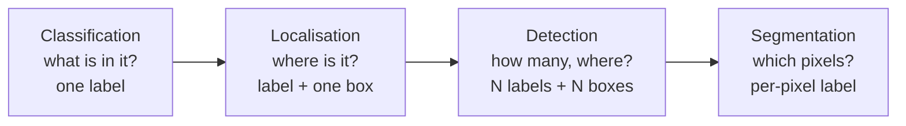

Take a modest colour photograph — 1000×1000 pixels, three channels. That is three million numbers.

Feed it to an ordinary fully connected layer with 1000 hidden units and the weight matrix alone holds

$$3{,}000{,}000 \times 1000 = 3 \times 10^{9} \text{ parameters}$$

Three billion weights, in the *first layer*, before the network has learned anything. You cannot fit that on a GPU, you cannot train it without overfitting catastrophically, and you have not yet asked it to do anything harder than "is this a cat".

This is the problem the whole series is about. Convolution is the answer, and these notes are about why it works and what gets built on top of it.

## What "computer vision" actually asks for

The tasks form a ladder, and each rung needs strictly more than the one below:

Classification returns a label. Localisation adds a bounding box for a single object. Detection handles an unknown number of objects at unknown positions and scales — that is where the second half of this series ends up, with anchor boxes and non-max suppression. Segmentation labels every pixel.

There is also a family of tasks that are not recognition at all — neural style transfer recombines the content of one image with the texture statistics of another — but the ladder above is what drove the architectures.

## The moment it changed

Vision had a benchmark, ImageNet , and an annual competition run on it . The top-5 error rates tell the story better than any prose:

| Year | Winner | Top-5 error | What was new |
|---|---|---|---|
| 2010 | NEC-UIUC | 28.2% | hand-engineered features (SIFT, LBP) + SVM |
| 2011 | XRCE | 25.8% | Fisher vectors |
| 2012 | AlexNet  | 16.4% | a deep ConvNet, trained on two GPUs |
| 2013 | ZFNet  | 11.7% | smaller first-layer filters |
| 2014 | GoogLeNet  | 6.7% | Inception modules |
| 2015 | ResNet  | 3.57% | residual connections, 152 layers |

Two things to notice. The first is 2012: a **9.4 point** drop in a single year, after two years of incremental progress on hand-engineered features. The second is that by 2015 the winning error was below the roughly 5.1% a careful human annotator achieves on the same task .

Every architecture in that table gets its own post later in this series. They are all convolutional.

## Why convolution instead

Convolution replaces the dense layer with two constraints, and both are statements about what images *are*.

**Parameter sharing.** A filter that detects a vertical edge at the top-left of an image detects one just as well at the bottom-right. So learn the filter once and slide it everywhere, rather than learning a separate weight per position. One 3×3 filter over three channels is 27 weights plus a bias — 28 numbers — whether the image is 32×32 or 1000×1000.

**Sparse connectivity.** Each output value depends only on the small patch of input under the filter, not on all three million pixels. Distant pixels influence one another only after several layers have stacked, which matches the locality real images actually have.

Together these turn that 3-billion-parameter layer into something with a few hundred weights that also *generalises better*, because the constraints happen to be true of the data. That is the whole trick, and the parameter count is worked through properly in part 8 of this series.

## What actually matters

**The parameter count is the argument, not an aside.** It is tempting to read "convolution exploits spatial structure" as a soft, intuitive claim. It is not — it is the difference between $$3 \times 10^{9}$$ and $$10^{2}$$ weights for the same layer. Every architecture in this series is a different answer to "given that, how should we spend what we saved?"

**Benchmark numbers age badly, and the table above is a good example.** Those are top-5 error rates on ILSVRC classification. They are not comparable to numbers quoted for detection or segmentation, nor to the same networks under modern training recipes — a ResNet-50 trained with 2020s augmentation and schedules beats its 2015 self by several points with no architectural change at all. Compare architectures only when the training setup is held fixed.

**Cross-pollination runs both ways.** Batch normalisation  and dropout  came out of this line of work and are now used far outside vision. Read these architectures for the ideas, not just for the leaderboard positions.

## References


