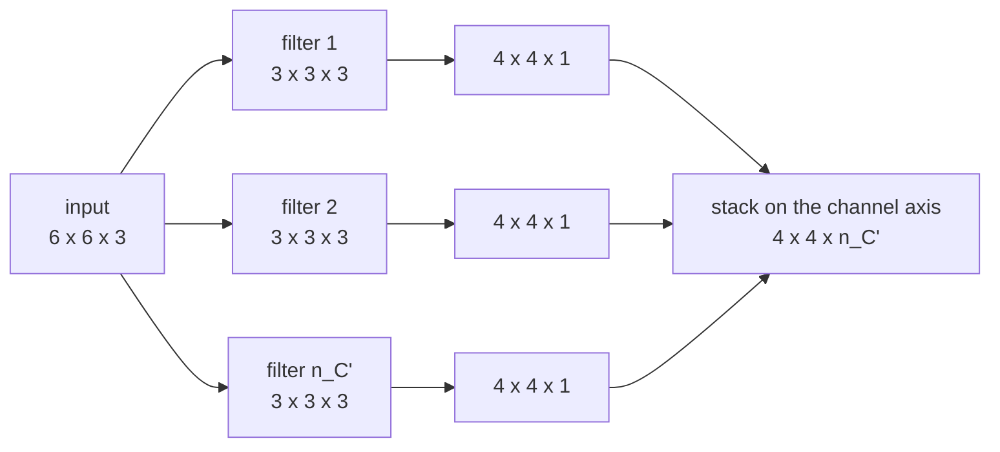

Real images are not flat. An RGB image is a **volume** — height × width × channels — and everything so far has quietly assumed a single channel.

The extension is smaller than it looks, and it hinges on one rule.

## The filter spans every channel

Convolve a 6×6×3 image with a 3×3 filter and that filter is really **3×3×3**. It has 27 weights, not 9. The third dimension of the filter always equals the number of input channels; there is no choice about it.

At each position, all 27 products are summed into **one** number:

$$S[i,j] \;=\; \sum_{m=0}^{f-1}\sum_{n=0}^{f-1}\sum_{c=0}^{n_C-1} I[i+m,\; j+n,\; c] \; K[m,n,c]$$

So a 6×6×3 input with one 3×3×3 filter gives a 4×4×**1** output. The channels collapse. Convolution over a volume returns a flat map, because the sum runs over $$c$$ as well.

That collapse is the whole point of the rule. It also means "convolve each channel separately" is a *different operation* — depthwise convolution, which [MobileNet](/mobilenet/) is built from.

Because the filter spans channels, it can be selective about them. A filter with the vertical-edge pattern in the red slice and zeros in green and blue detects vertical edges *in red only*. A filter with the same pattern in all three slices detects vertical edges regardless of colour.

## Depth comes from stacking filters

One filter gives one output map. To get more, use more filters, and stack their outputs along a new channel axis:

So the general shape rule for a convolutional layer is

$$n_H \times n_W \times n_C \;\;\longrightarrow\;\; \left\lfloor \frac{n_H + 2p - f}{s} \right\rfloor + 1 \;\times\; \left\lfloor \frac{n_W + 2p - f}{s} \right\rfloor + 1 \;\times\; n_C'$$

where $$n_C$$ is the input channel count — which the filter must match — and $$n_C'$$ is the number of filters, which is a free hyperparameter.

**The output channel count is exactly the number of filters.** That is the only thing that sets it. When a paper says "a 3×3 convolution with 256 channels", it means 256 separate 3×3×$$n_C$$ filters.

## The parameter count

Each filter is $$f \times f \times n_C$$ weights plus one bias. With $$n_C'$$ filters:

$$\text{parameters} = \big(f \cdot f \cdot n_C + 1\big) \cdot n_C'$$

For 10 filters of size 3×3 over a 3-channel input: $$(3 \cdot 3 \cdot 3 + 1) \cdot 10 = 280$$.

Note what is *absent* from that formula: $$n_H$$ and $$n_W$$. The parameter count does not depend on the size of the image. The same layer costs 280 weights on a 32×32 thumbnail and on a 4000×3000 photograph — only the compute changes. This is parameter sharing, and it is the property that makes the [three-billion-parameter problem from part 1](/computervision/) go away.

## What actually matters

**Channels are not colours after layer one.** It is natural to picture the three channels as red, green and blue, and for the input that is right. After the first layer the channels are 64 or 256 learned feature maps with no colour interpretation whatsoever — channel 37 is "whatever filter 37 responded to". Carrying the RGB intuition past layer one is the single most common way to get confused about what a deep feature map contains.

**Compute and parameters scale differently, and the difference decides architectures.** Parameters go as $$f^2 n_C n_C'$$. Compute goes as $$f^2 n_C n_C' n_H n_W$$ — the same thing multiplied by the number of positions. Early layers have large $$n_H, n_W$$ and few channels, so they are cheap in parameters and expensive in compute. Late layers are the reverse. That asymmetry is why 1×1 convolutions are worth a whole post, why Inception bottlenecks where it does, and why "parameter count" and "FLOPs" rank models differently.

**A filter's channel dimension is not a hyperparameter you get to pick.** It is dictated by the layer beneath. The only free choices are $$f$$, $$s$$, $$p$$ and $$n_C'$$.

## Source code

- [`Convolution_model_Step_by_Step_v1.ipynb`](https://github.com/danghoangnhan/cousera/tree/main/ConvolutionalNeuralNetworks/week1/W1A1) — `conv_forward` loops over exactly these four axes: position, position, filter, and the channel sum inside `conv_single_step`.

*[CNN]: Convolutional Neural Network
