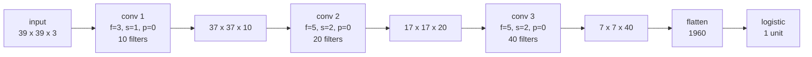

Everything in parts 2 through 8 assembled into one network, with every shape derived rather than asserted.

The input is a 39×39×3 image and the task is binary classification.

## Deriving each shape

The rule, from [part 4](/strided-convolution/):

$$n^{[l]} = \left\lfloor \frac{n^{[l-1]} + 2p^{[l]} - f^{[l]}}{s^{[l]}} \right\rfloor + 1$$

**Layer 1** — $$f=3$$, $$s=1$$, $$p=0$$, 10 filters:

$$\left\lfloor \frac{39 + 0 - 3}{1} \right\rfloor + 1 = 37 \;\Rightarrow\; 37 \times 37 \times 10$$

**Layer 2** — $$f=5$$, $$s=2$$, $$p=0$$, 20 filters:

$$\left\lfloor \frac{37 + 0 - 5}{2} \right\rfloor + 1 = \lfloor 16 \rfloor + 1 = 17 \;\Rightarrow\; 17 \times 17 \times 20$$

**Layer 3** — $$f=5$$, $$s=2$$, $$p=0$$, 40 filters:

$$\left\lfloor \frac{17 + 0 - 5}{2} \right\rfloor + 1 = \lfloor 6 \rfloor + 1 = 7 \;\Rightarrow\; 7 \times 7 \times 40$$

**Flatten** — $$7 \times 7 \times 40 = 1960$$ values into a vector, then one logistic unit for the binary decision.

## The full accounting

| Layer | Output shape | Activation size | Parameters |
|---|---|---|---|
| Input | 39 × 39 × 3 | 4,563 | 0 |
| Conv 1 (3×3, s1, ×10) | 37 × 37 × 10 | 13,690 | $$(3 \cdot 3 \cdot 3 + 1) \cdot 10 = 280$$ |
| Conv 2 (5×5, s2, ×20) | 17 × 17 × 20 | 5,780 | $$(5 \cdot 5 \cdot 10 + 1) \cdot 20 = 5{,}020$$ |
| Conv 3 (5×5, s2, ×40) | 7 × 7 × 40 | 1,960 | $$(5 \cdot 5 \cdot 20 + 1) \cdot 40 = 20{,}040$$ |
| Flatten | 1,960 | 1,960 | 0 |
| Logistic | 1 | 1 | $$1960 + 1 = 1{,}961$$ |
| **Total** | | | **27,301** |

Note the two trends running in opposite directions, which is the shape of essentially every classification ConvNet:

- **Spatial dimensions shrink**: 39 → 37 → 17 → 7.
- **Channel depth grows**: 3 → 10 → 20 → 40.
- **Activation size falls**: 4,563 → 13,690 → 5,780 → 1,960.

The network trades *where* something is for *what* it is. By the last conv layer there are 40 feature types and only 49 positions; at the input there were 3 channels and 1,521 positions.

The activation size rising at layer 1 before falling is normal, and worth watching in a real network — activation memory during training is usually dominated by the early layers, while parameter memory is dominated by the late ones.

## What actually matters

**Do this arithmetic before writing the code, every time.** Layer 2 above produces 17×17 from 37×37 — not 18, not 16. The floor discards a filter position, so the last row and column of the layer-1 output never reach layer 2. That is invisible in a diagram and invisible in the code, and it is the single most common cause of a shape mismatch surfacing three layers later.

**Where the parameters sit is the whole story of the architectures that follow.** Here, conv 3 holds 73% of the weights and the classifier holds 7%. Now scale it: at 224×224 with VGG-sized dense layers, the fully connected block holds ~90% of the parameters . That imbalance is what global average pooling was invented to fix , and it is why [Inception](/inception-network/) and ResNet look the way they do.

**A network like this has one design freedom that matters and several that do not.** $$f$$, $$s$$, $$p$$ and the filter counts are all choices, but only the filter counts and the downsampling schedule meaningfully change what the network can do. Most published architectures fix $$f=3$$ throughout and vary only depth and width — which is precisely the parameterisation [EfficientNet](/efficientnet/) later formalises.

## Source code

- [`Convolution_model_Application.ipynb`](https://github.com/danghoangnhan/cousera/tree/main/ConvolutionalNeuralNetworks/week1/W1A2) — the same structure built in TensorFlow, where `model.summary()` prints the table above.

## References


