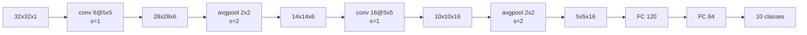

Three networks, seventeen years apart. Read in order they show what actually changed — and how little of it was the convolution operation itself.

## LeNet-5 (1998)

Built to read handwritten digits on bank cheques . Input is 32×32 greyscale.

About **60,000 parameters** — small enough to train on 1998 hardware, which was the binding constraint.

The pattern it established is still the pattern: `conv → pool → conv → pool → fully connected → output`, with spatial dimensions shrinking (32 → 28 → 14 → 10 → 5) while channel depth grows (1 → 6 → 16).

What dates it: sigmoid and tanh activations rather than ReLU, average pooling rather than max, and a nonlinearity applied *after* pooling.

## AlexNet (2012)

The network that ended the hand-engineered-features era, with the 16.4% ILSVRC top-5 error from [part 1](/computervision/) . Input is 227×227×3.

| Layer | Config | Output |
|---|---|---|
| conv 1 | 96 @ 11×11, s=4 | 55 × 55 × 96 |
| maxpool | 3×3, s=2 | 27 × 27 × 96 |
| conv 2 | 256 @ 5×5, same | 27 × 27 × 256 |
| maxpool | 3×3, s=2 | 13 × 13 × 256 |
| conv 3 | 384 @ 3×3, same | 13 × 13 × 384 |
| conv 4 | 384 @ 3×3, same | 13 × 13 × 384 |
| conv 5 | 256 @ 3×3, same | 13 × 13 × 256 |
| maxpool | 3×3, s=2 | 6 × 6 × 256 |
| flatten | | 9,216 |
| FC | | 4,096 |
| FC | | 4,096 |
| softmax | | 1,000 |

About **60 million parameters** — a thousand times LeNet.

Structurally it is LeNet made bigger. What was genuinely new was everything around it: **ReLU** instead of sigmoid, which trains several times faster and does not saturate; **dropout** in the fully connected layers ; heavy **data augmentation**; and splitting the model across two GPUs because one had insufficient memory.

That last point is worth sitting with. AlexNet's most-copied ideas were not architectural.

## VGG-16 (2015)

VGG's contribution is a constraint: **every convolution is 3×3, stride 1, same padding; every pool is 2×2, stride 2** . Nothing else varies.

| Block | Config | Output |
|---|---|---|
| input | | 224 × 224 × 3 |
| conv ×2 | 64 @ 3×3 | 224 × 224 × 64 |
| pool | | 112 × 112 × 64 |
| conv ×2 | 128 @ 3×3 | 112 × 112 × 128 |
| pool | | 56 × 56 × 128 |
| conv ×3 | 256 @ 3×3 | 56 × 56 × 256 |
| pool | | 28 × 28 × 256 |
| conv ×3 | 512 @ 3×3 | 28 × 28 × 512 |
| pool | | 14 × 14 × 512 |
| conv ×3 | 512 @ 3×3 | 14 × 14 × 512 |
| pool | | 7 × 7 × 512 |
| FC | | 4,096 |
| FC | | 4,096 |
| softmax | | 1,000 |

About **138 million parameters**. The channel count doubles at each stage — 64, 128, 256, 512 — and then stops, because 1024 was too expensive.

### Why 3×3, always

This is the argument worth carrying forward. Two stacked 3×3 convolutions see the same 5×5 region of input as one 5×5 convolution. Three stacked see 7×7. But the parameter counts differ. For $$C$$ input and output channels:

$$\underbrace{2 \times (3 \times 3 \times C \times C)}_{\text{two } 3\times3} = 18C^2 \qquad \text{versus} \qquad \underbrace{5 \times 5 \times C \times C}_{\text{one } 5\times5} = 25C^2$$

and for the 7×7 equivalent:

$$\underbrace{3 \times (3 \times 3 \times C \times C)}_{\text{three } 3\times3} = 27C^2 \qquad \text{versus} \qquad \underbrace{7 \times 7 \times C \times C}_{\text{one } 7\times7} = 49C^2$$

So the stack is **45% cheaper** at the same receptive field — and it applies the nonlinearity three times instead of once, which makes it strictly more expressive. Two wins for one constraint.

This is why almost every architecture after VGG uses 3×3 as its default and reserves larger filters for the stem.

## The three side by side

| | LeNet-5 | AlexNet | VGG-16 |
|---|---|---|---|
| Year | 1998 | 2012 | 2015 |
| Input | 32×32×1 | 227×227×3 | 224×224×3 |
| Weight layers | 5 | 8 | 16 |
| Parameters | ~60K | ~60M | ~138M |
| Activation | sigmoid / tanh | ReLU | ReLU |
| Pooling | average | max | max |
| Filter sizes | 5×5 | 11×11, 5×5, 3×3 | 3×3 only |

Parameters grew by 2,300× in seventeen years while depth grew by 3×. That ratio is the problem the next three posts are about.

## What actually matters

**Most of VGG's 138 million parameters are not in the convolutions.** Flatten 7×7×512 into 25,088 and connect it to 4,096 units and that single layer holds $$25{,}088 \times 4{,}096 \approx 103$$ million weights — roughly **75% of the whole network**, in one layer that does no convolution at all. Every efficient architecture that follows attacks this number, and global average pooling ([part 7](/poolinglayers/)) is what eventually removes it.

**Depth stopped being the free variable right here.** VGG tried 19 layers and got almost nothing over 16. Plain stacking had hit a wall that was not about overfitting — which is exactly the observation [ResNet](/resnets-residual-blocks/) starts from.

**"Bigger AlexNet" is a fair description of VGG and an unfair one of what mattered.** The uniformity is the contribution. Fixing $$f=3$$, $$s=1$$, same padding everywhere means the only remaining design decisions are depth and channel width — which is precisely the two-dimensional space [EfficientNet](/EfficientNet/) later searches systematically. Constraining the architecture is what made scaling it a tractable question.

## Source code

- [`Convolution_model_Application.ipynb`](https://github.com/danghoangnhan/cousera/tree/main/ConvolutionalNeuralNetworks/week1/W1A2) — a small network in this LeNet lineage, where the shape and parameter tables above can be printed directly.

## References


