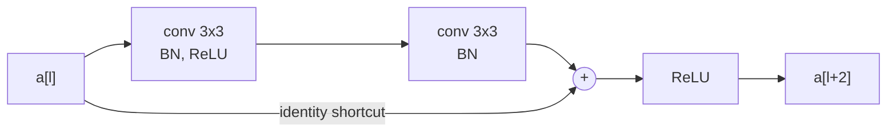
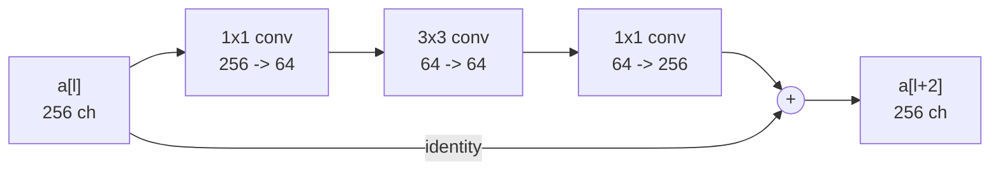

[VGG](/classic-networks-lenet-alexnet-vgg/) tried 19 layers and gained almost nothing over 16. Push a plain stack deeper and it gets *worse*. ResNet is the answer to why .

## The degradation problem

Take a 20-layer network and a 56-layer one, same design, same data. The 56-layer network has higher **training** error.

That is the surprising word. Higher *test* error would be overfitting — more capacity, memorising. But this is training error, on the data the network is directly optimising. The deeper network is failing to fit data the shallower one fits.

And it cannot be a capacity problem, because there is a construction that proves the deeper network is at least as expressive: take the trained 20-layer network, copy it into the first 20 layers of the 56-layer one, and make the remaining 36 layers compute the identity. Same function, same training error.

So a solution exists and gradient descent does not find it. **The problem is optimisation, not representation.** Deep plain stacks are hard to optimise, and the specific thing they are bad at is learning to leave a signal alone.

## The residual block

If identity is what the optimiser struggles to learn, build it in. Instead of asking two layers to compute $$H(x)$$ directly, ask them for the *residual* $$F(x) = H(x) - x$$, and add $$x$$ back:

$$a^{[l+2]} = g\big(z^{[l+2]} + a^{[l]}\big)$$

The addition happens **before** the final ReLU, not after. That ordering is deliberate and [part 12](/why-resnets-work/) explains what it buys.

Now identity is the *default*. Drive the block's weights to zero and $$z^{[l+2]} = 0$$, so $$a^{[l+2]} = g(a^{[l]}) = a^{[l]}$$ for ReLU on already non-negative activations. The block does nothing, harmlessly. Layers that have nothing to contribute can switch themselves off, which is exactly the construction the degradation problem showed was unreachable.

### When the shapes do not match

$$z^{[l+2]} + a^{[l]}$$ requires both to have the same shape. At a stage transition — stride 2, or a change in channel count — they do not. Two options:

$$a^{[l+2]} = g\big(z^{[l+2]} + W_s\, a^{[l]}\big)$$

where $$W_s$$ is either a learned 1×1 convolution with the matching stride (a *projection* shortcut), or zero-padding of the extra channels (an *identity* shortcut, parameter-free). The paper finds projection slightly better and identity nearly as good for far less cost — so real implementations use identity everywhere except at the transitions.

## The bottleneck block

At 50 layers and beyond, two 3×3 convolutions at 256 channels is too expensive. ResNet-50 and deeper use a three-layer block instead:

The 1×1 convolutions squeeze 256 channels down to 64, do the expensive 3×3 work there, then restore the width. Comparing the two designs at 256 channels:

$$\underbrace{2 \times (3 \cdot 3 \cdot 256 \cdot 256)}_{\text{two } 3\times3} \approx 1.18\text{M} \qquad \text{versus} \qquad \underbrace{(1 \cdot 1 \cdot 256 \cdot 64) + (3 \cdot 3 \cdot 64 \cdot 64) + (1 \cdot 1 \cdot 64 \cdot 256)}_{\text{bottleneck}} \approx 0.07\text{M}$$

Around **17× cheaper** for the same input and output shape. Why a 1×1 convolution can do this at all is [part 13](/one-by-one-convolutions/).

## What it bought

| Model | Layers | Params | ImageNet top-1 error |
|---|---|---|---|
| VGG-16  | 16 | 138M | 28.1% |
| ResNet-34 | 34 | 21.8M | 26.7% |
| ResNet-50 | 50 | 25.6M | 24.7% |
| ResNet-101 | 101 | 44.5M | 23.6% |
| ResNet-152 | 152 | 60.2M | 23.0% |

ResNet-152 has **8× the depth of VGG-16 and fewer than half its parameters**, because it has no giant fully connected layer — global average pooling ([part 7](/poolinglayers/)) replaced it. Its ILSVRC-2015 ensemble reached 3.57% top-5, the number that beat human annotator performance.

Crucially, error now *decreases* monotonically with depth. The degradation problem is gone.

## What actually matters

**The shortcut is addition, not concatenation.** $$z + a$$, not $$[z, a]$$. Addition keeps the channel count fixed and adds no parameters, which is why blocks stack indefinitely. Concatenation is a different architecture — DenseNet — with different costs. Reading the wrong operation into the diagram makes the parameter counts above impossible to reproduce.

**Residual connections are now infrastructure, not a vision trick.** Every transformer block has two of them. They appear in [MobileNetV2](/MobileNetArchitecture/), in [EfficientNet](/EfficientNet/)'s MBConv, and in essentially every deep architecture trained since 2016. This post is arguably the most reused idea in the series.

**Depth stopped being the interesting variable again, just at a different scale.** ResNet-1202 was trained in the same paper and performs *worse* than ResNet-110 — overfitting, this time genuinely. Residual connections removed the optimisation barrier; they did not make depth free. The gains from 152 to 1202 layers are negative, and the field moved to width, cardinality and resolution instead.

## Source code

- [`Residual_Networks.ipynb`](https://github.com/danghoangnhan/cousera/blob/main/ConvolutionalNeuralNetworks/Residual_Networks.ipynb) — builds both the identity block and the projection (convolutional) block, then assembles ResNet-50 from them.

## References


