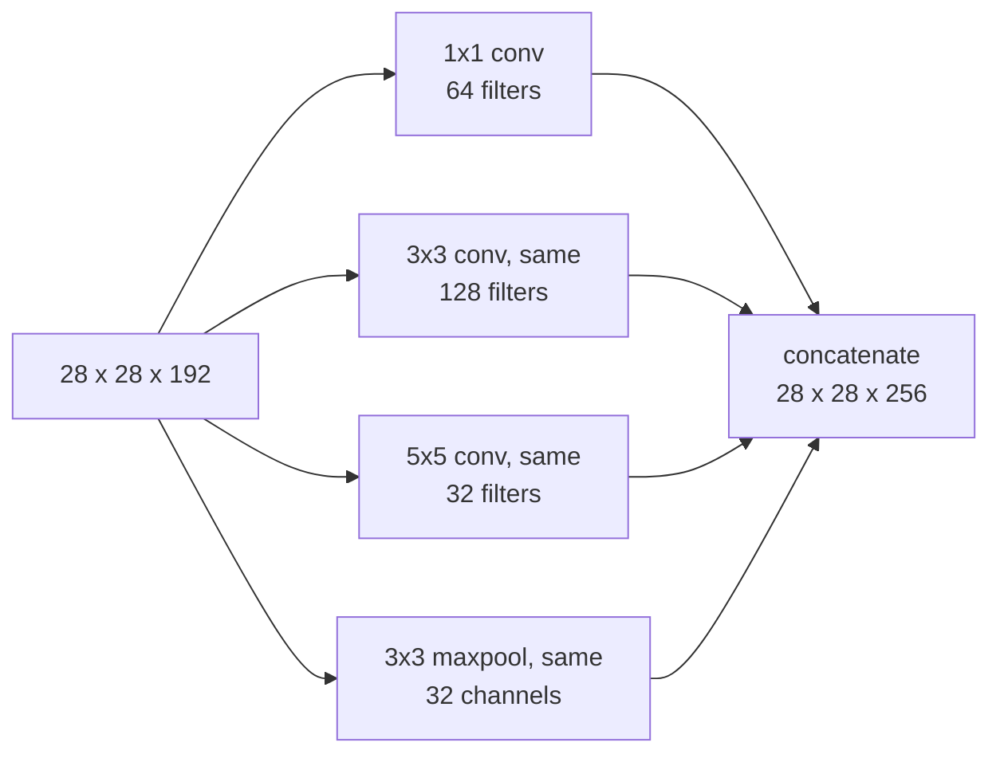
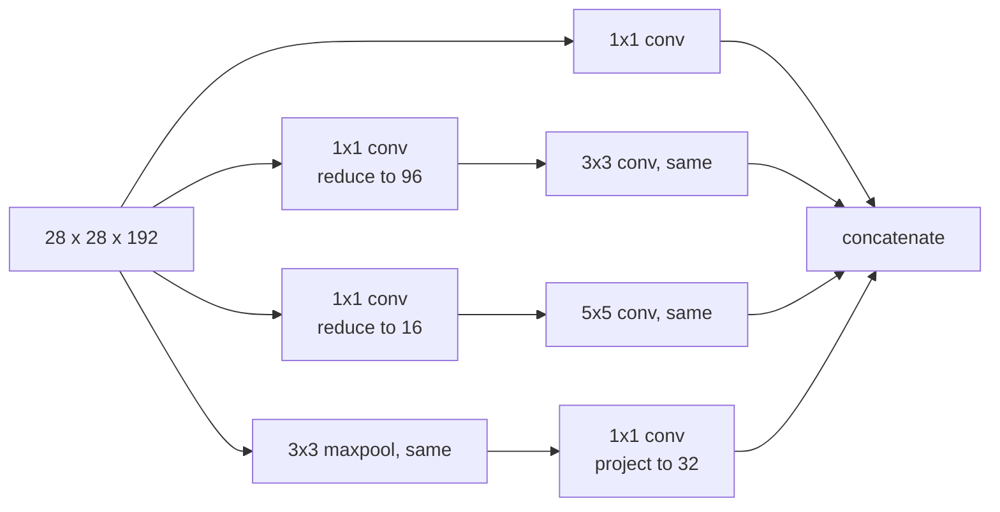

Every layer so far has forced a choice: 1×1, 3×3, 5×5, or pool? [VGG](/classic-networks-lenet-alexnet-vgg/) answered by fixing 3×3 everywhere and never revisiting it.

Inception's answer is to refuse the question — **do all of them, and let the network weight the results** .

## The naive module

Take a 28×28×192 input. Apply every option in parallel, pad so they all produce 28×28, and concatenate along the channel axis:

$$64 + 128 + 32 + 32 = 256$$ output channels. The network learns how much of each branch it wants by learning the filters in each; a branch that is useless gets small weights.

Note this is **concatenation**, not the addition ResNet uses. The channel counts add up, and they are chosen per branch.

## The problem: the 5×5 branch

Count the multiplies in that 5×5 branch alone. 32 filters, each 5×5×192, evaluated at 28×28 positions:

$$\underbrace{28 \times 28 \times 32}_{\text{output values}} \times \underbrace{5 \times 5 \times 192}_{\text{per value}} \;=\; \mathbf{120 \text{ million multiplies}}$$

For **one branch of one layer**. Stack nine of these modules, as GoogLeNet does, and the network is unaffordable in 2014 terms — and this is why the naive module was never actually used.

## The fix: bottleneck first

Insert a 1×1 convolution to cut 192 channels down to 16 before the expensive 5×5 ([part 13](/one-by-one-convolutions/) is why this works):

$$28 \times 28 \times 192 \;\xrightarrow{\;1\times1,\; 16\;}\; 28 \times 28 \times 16 \;\xrightarrow{\;5\times5,\; 32\;}\; 28 \times 28 \times 32$$

Now count both steps:

$$\underbrace{28 \times 28 \times 16 \times (1 \times 1 \times 192)}_{2.4\text{M}} \;+\; \underbrace{28 \times 28 \times 32 \times (5 \times 5 \times 16)}_{10.0\text{M}} \;=\; \mathbf{12.4 \text{ million}}$$

| | Multiplies |
|---|---|
| Direct 5×5 | 120M |
| With 1×1 bottleneck | 12.4M |
| **Ratio** | **~10×** |

Identical input shape, identical output shape, one tenth the compute. The 16-channel middle layer is the "bottleneck", and the whole module is built around them.

## The real module

Every expensive branch gets a bottleneck, and the pooling branch gets a 1×1 *after* it — pooling cannot change the channel count ([part 7](/poolinglayers/)), so without that projection the pool branch would contribute all 192 input channels to the concatenation and dominate it:

That asymmetry is worth noticing: reduce *before* convolution, project *after* pooling.

## What actually matters

**Does the bottleneck hurt?** It is the obvious objection — squeezing 192 channels into 16 must lose something. Empirically, within reason, performance is unaffected. But "within reason" is load-bearing: the reduction ratio is a tuned hyperparameter, and squeezing too hard does cost accuracy. Inception's own ratios vary per branch and per module, which is what a tuned quantity looks like.

**Multiply-adds are not latency, and this module is the standard example.** Four parallel branches with different filter sizes, then a concatenation, is far less GPU-friendly than one dense stack of 3×3s: more kernel launches, worse memory locality, poor arithmetic intensity. Inception has fewer FLOPs than VGG and is not proportionally faster. This gap between counted operations and measured time recurs for [MobileNet](/MobileNet/) and [EfficientNet](/EfficientNet/), and it is why papers increasingly report latency on named hardware instead of FLOPs.

**"Let the network decide" has a hidden cost.** The branch *widths* — 64, 128, 32, 32 — are still hand-chosen, and there are four of them per module across nine modules. Inception replaced one hyperparameter (which filter size) with several (how wide is each branch). That is a real trade, and it is a large part of why neural architecture search became attractive: by [EfficientNet](/EfficientNet/) the branch structure is searched rather than designed.

## References


