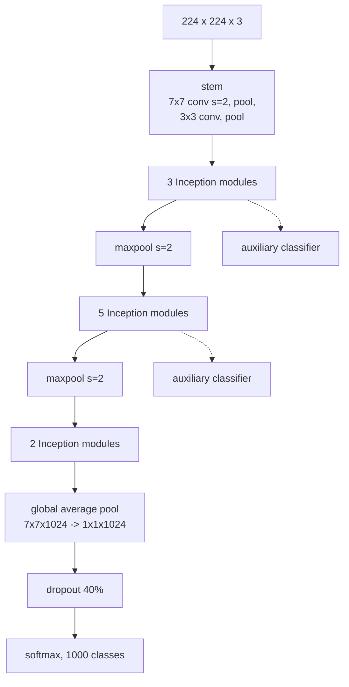

[Part 14](/Inception-Network-Motivation/) built one Inception module. GoogLeNet is nine of them stacked, and the assembly has two features worth more than the module itself .

## The shape of it

The headline number:

| Model | Parameters | ILSVRC-2014 top-5 |
|---|---|---|
| VGG-16  | 138M | 7.3% |
| GoogLeNet | **6.8M** | **6.7%** |

**Twenty times fewer parameters, and it won.** Two things bought that: the bottlenecks from part 14, and one structural decision.

## Global average pooling did most of it

Recall from [part 10](/classic-networks-lenet-alexnet-vgg/) that VGG's first fully connected layer alone holds ~103 million weights — about 75% of the network.

GoogLeNet has no such layer. After the final module the feature map is 7×7×1024, and instead of flattening it into 50,176 values and connecting that to a dense layer, it averages each channel down to a single number :

$$7 \times 7 \times 1024 \;\longrightarrow\; 1 \times 1 \times 1024$$

The classifier is then one 1024→1000 layer: about a million parameters instead of a hundred million. The 20× parameter reduction is mostly this one substitution, not the Inception modules.

It also makes the network input-size agnostic — global average pooling produces $$1 \times 1 \times n_C$$ whatever the spatial dimensions were, so there is no flatten with a hard-coded size.

## The auxiliary classifiers

Two extra softmax heads hang off intermediate modules during training. Their losses are added to the main loss with weight 0.3, and they are **discarded entirely at inference**.

The original justification was gradient flow: a 22-layer network in 2014, before [ResNet](/resnets-residual-blocks/) existed, had trouble propagating gradient to its early layers, and injecting loss partway up gives those layers a shorter path to a training signal.

That explanation did not survive. The Inception-v3 paper revisited it and found the auxiliary heads do not help early training at all — the networks converge at the same rate with and without them. What they do is act as **regularisers**, and the effect only appears late in training . The v3 paper removed the lower auxiliary head entirely as useless.

This is a good example of a plausible mechanism being widely repeated after its own authors withdrew it.

## What v2 and v3 changed

The successors are mostly about factorising convolutions further :

- **5×5 → two stacked 3×3**, the same argument VGG made in [part 10](/classic-networks-lenet-alexnet-vgg/): $$18C^2$$ instead of $$25C^2$$.
- **$$n \times n$$ → $$1 \times n$$ then $$n \times 1$$.** A 3×3 becomes a 1×3 followed by a 3×1, costing $$6C^2$$ instead of $$9C^2$$ — a 33% saving. This asymmetric factorisation works well on medium-sized feature maps and poorly early on.
- **Batch normalisation throughout** , which is what "v2" mostly means.
- **Label smoothing**, and a redesigned downsampling block that avoids a representational bottleneck.

Inception-v3 reaches 78.8% top-1 with 24M parameters — the row that appears in the [EfficientNet](/EfficientNet/) comparison table.

Inception-v4 and Inception-ResNet later added residual connections to the modules, which is the two lines of this series converging.

## What actually matters

**The parameter win is mostly global average pooling, not Inception.** The modules are the interesting idea and the pooling substitution is the one that moved the number. It is worth separating them when reading the paper, because the substitution transfers to any architecture and the modules largely did not.

**Auxiliary classifiers are a cautionary tale about mechanism stories.** "It helps gradients reach early layers" is intuitive, was stated by the authors, was repeated for years, and was contradicted by the same group's follow-up. Deep learning is full of these; the useful habit is to check whether a mechanism was ever actually tested or merely proposed alongside a result that worked.

**Nothing in the Inception line survived contact with ResNet.** The multi-branch module is largely a historical artefact — modern architectures are overwhelmingly residual stacks of 3×3 (or depthwise) convolutions with uniform structure. What did survive is the 1×1 bottleneck, which is now in every efficient block, [MobileNet](/MobileNet/) and [EfficientNet](/EfficientNet/) included. Read Inception for the bottleneck, not the branches.

## References


