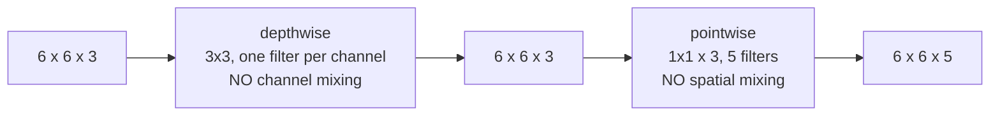

A standard convolution does two jobs at once: it combines information **across space** (the $$f \times f$$ window) and **across channels** (the sum over $$n_C$$, from [part 5](/convolutions-over-volume/)).

MobileNet's observation is that those two jobs can be separated, and that separating them is roughly nine times cheaper .

## The standard cost

Input $$n \times n \times n_C$$, filter $$f \times f \times n_C$$, $$n_C'$$ filters, "same" padding. Each output value costs $$f^2 n_C$$ multiplies, and there are $$n^2 n_C'$$ of them:

$$\text{cost}_{\text{standard}} = f^2 \cdot n_C \cdot n_C' \cdot n^2$$

Concretely, a 6×6×3 input with 3×3 filters and 5 output channels, same padding:

$$3^2 \times 3 \times 5 \times 6^2 = 9 \times 3 \times 5 \times 36 = 4{,}860 \text{ multiplies}$$

## Splitting it in two

**Depthwise convolution** filters each input channel with its own $$f \times f$$ kernel and does *not* sum across channels. Three input channels, three kernels, three output channels — the channel count cannot change:

$$\text{cost}_{\text{depthwise}} = f^2 \cdot n_C \cdot n^2 = 9 \times 3 \times 36 = 972$$

This is exactly the operation [part 5](/convolutions-over-volume/) flagged as *not* being ordinary convolution.

**Pointwise convolution** is a 1×1 convolution ([part 13](/one-by-one-convolutions/)): it mixes channels and not space, and it sets the output channel count:

$$\text{cost}_{\text{pointwise}} = n_C \cdot n_C' \cdot n^2 = 3 \times 5 \times 36 = 540$$

Together: $$972 + 540 = 1{,}512$$ against 4,860, a factor of **3.2×** on this small example.

## The general ratio

$$\frac{\text{cost}_{\text{separable}}}{\text{cost}_{\text{standard}}} = \frac{f^2 n_C n^2 + n_C n_C' n^2}{f^2 n_C n_C' n^2} = \frac{1}{n_C'} + \frac{1}{f^2}$$

Two terms, and the second dominates in practice. For a 3×3 filter, $$1/f^2 = 1/9$$, and real networks have hundreds of output channels so $$1/n_C'$$ is negligible:

| $$n_C'$$ | $$f$$ | Ratio | Speed-up |
|---|---|---|---|
| 5 | 3 | $$1/5 + 1/9 = 0.31$$ | 3.2× |
| 64 | 3 | $$1/64 + 1/9 = 0.127$$ | 7.9× |
| 512 | 3 | $$1/512 + 1/9 = 0.113$$ | 8.9× |
| 1024 | 3 | $$1/1024 + 1/9 = 0.112$$ | 8.9× |

So the saving converges to $$1/f^2$$ — about **9× for 3×3 filters**, and it is essentially the filter area. That is the number quoted in the paper, and this is where it comes from.

The same accounting applies to parameters, not just multiplies.

## What it cost in accuracy

| Model | Params | Multiply-adds | ImageNet top-1 |
|---|---|---|---|
| VGG-16  | 138M | 15.3B | 71.5% |
| GoogLeNet  | 6.8M | 1.55B | 69.8% |
| MobileNet v1 | 4.2M | 0.57B | 70.6% |

Within a point of VGG at **27× fewer multiplies and 33× fewer parameters**. MobileNet v1 also exposes a width multiplier $$\alpha$$ and a resolution multiplier $$\rho$$ that scale it down further — two of the three knobs [EfficientNet](/EfficientNet/) later scales *together* rather than separately.

## What actually matters

**Depthwise separable convolution is a factorisation, and it is a restriction.** A standard convolution can learn any joint function of space and channels; the separable version can only learn things that factor into "filter each channel spatially, then mix channels". That is strictly less expressive, and the accuracy table is the price. It is a good trade at this ratio, but it is a trade — not a free reformulation of the same operation.

**The 9× is in multiplies and almost never in wall-clock.** Depthwise convolution has terrible arithmetic intensity: it reads a whole feature map to do very little arithmetic per byte, so it is memory-bandwidth-bound where a dense convolution is compute-bound. GPUs are built for the latter. A MobileNet with 27× fewer multiplies than VGG is nowhere near 27× faster on a desktop GPU, and can be slower per FLOP than a much larger dense model. It was designed for phone CPUs, where the arithmetic really is the constraint. Benchmark on the hardware you will deploy on — this is the single most misleading number in efficient-architecture papers.

**The same factorisation scales up, not just down.** Xception applies depthwise separable convolutions to a full-size Inception-style network rather than a mobile one, and beats Inception-v3 at equal parameter count . The idea is not inherently about small models — it is a better use of a parameter budget at any size, which is what makes it the default block in [EfficientNet](/EfficientNet/) too.

**The two halves are not interchangeable.** Depthwise alone cannot change the channel count and never mixes channels, so a network of only depthwise convolutions has channels that never interact — three independent greyscale networks. The pointwise step is not an optimisation detail; without it the block does not work at all.

## Source code

- [`Transfer_learning_with_MobileNet_v1.ipynb`](https://github.com/danghoangnhan/cousera/tree/main/ConvolutionalNeuralNetworks/week2/W2A2) — loads MobileNetV2 from Keras, where the depthwise and pointwise layers appear separately in `model.summary()` with exactly the parameter counts above.

## References


