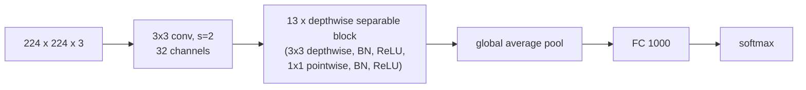
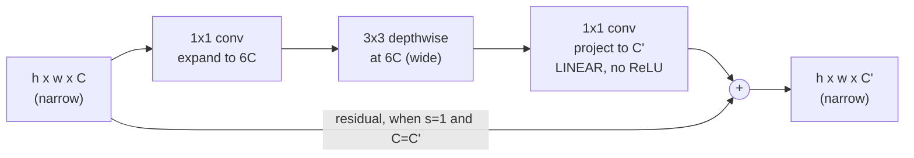

[Part 16](/MobileNet/) derived the depthwise separable block. This is what gets built out of it, and what v2 changed — which is more interesting than it first looks, because two of v2's three changes run *against* the obvious intuition.

## v1: stack the block 13 times

Downsampling is done with stride-2 depthwise convolutions rather than pooling ([part 4](/strided-convolution/)), and the classifier is global average pooling with no large dense layer, the same substitution [GoogLeNet](/Inception-Network/) made.

That is the whole of v1: 4.2M parameters, 70.6% top-1.

## v2: the inverted residual bottleneck

Three changes :

### 1. Expand first

A [ResNet bottleneck](/resnets-residual-blocks/) goes **wide → narrow → wide**: squeeze the channels, do the 3×3 work cheaply, restore the width. MobileNetV2 goes **narrow → wide → narrow**: expand the channels by a factor of 6, do the depthwise convolution there, then project back down.

That looks backwards until you notice that depthwise convolution is *already* cheap — it costs $$f^2 n_C n^2$$ with no $$n_C'$$ factor at all, so widening it costs linearly rather than quadratically. Doing the spatial filtering in a high-dimensional space is affordable precisely because the operator is depthwise. The expensive parts, the 1×1s, are the ones touching the narrow ends.

### 2. The residual connects the narrow ends

Hence "inverted". ResNet's skip connection joins the wide representations; v2's joins the thin ones. Since the thin tensors are what has to be kept in memory between blocks, this materially reduces peak memory on a phone — the wide $$6C$$ tensor exists only inside a block and can be discarded immediately.

### 3. The last layer is linear

The projection back down to $$C'$$ has **no ReLU**. This is the most counter-intuitive part and it is the paper's central claim.

The argument: ReLU destroys information, and how much it destroys depends on how much room the data has. In a high-dimensional space, a ReLU zeroing some coordinates loses relatively little — the information survives in the others. In a *low*-dimensional space, the same operation can collapse the representation irrecoverably. The paper demonstrates this by embedding a spiral into $$n$$ dimensions, applying ReLU, and projecting back: at $$n = 2$$ or $$3$$ the spiral is destroyed, at $$n = 15$$ or $$30$$ it is largely preserved.

The projection output is the narrowest tensor in the block, so putting a ReLU there is exactly the damaging case. Removing it is worth about a point of top-1 accuracy.

## What it bought

| Model | Params | Multiply-adds | ImageNet top-1 |
|---|---|---|---|
| MobileNet v1  | 4.2M | 0.57B | 70.6% |
| MobileNet v2 | 3.4M | 0.30B | 72.0% |
| ResNet-50  | 25.6M | 4.1B | 75.3% |

Better accuracy than v1 on fewer parameters and roughly half the multiplies.

This block — expand, depthwise, project linearly, add — is the MBConv that [EfficientNet](/EfficientNet/) scales, with squeeze-and-excitation added.

## What actually matters

**"Linear bottleneck" names the absence of an activation, not the presence of anything.** The phrase reads like a component; it means "we deleted the ReLU here". Reimplementations that helpfully add the activation back for consistency lose the accuracy the paper reports, and it is an easy mistake because every other 1×1 in the network has one.

**The expansion factor of 6 is tuned, not derived.** The paper sweeps 5 to 10 and finds the range flat, choosing 6. Smaller networks do better with smaller factors. Nothing in the argument fixes it at 6.

**The memory argument is the underrated one.** Most summaries of v2 talk about accuracy and FLOPs. The reason it is deployable is that only the thin tensors persist between blocks, so peak activation memory is set by $$C$$ rather than $$6C$$. On a phone that constraint often binds before compute does, and it is the sort of thing that never shows up in a FLOPs comparison.

## Source code

- [`Transfer_learning_with_MobileNet_v1.ipynb`](https://github.com/danghoangnhan/cousera/tree/main/ConvolutionalNeuralNetworks/week2/W2A2) — loads MobileNetV2 and prints the block structure; the expansion, depthwise and linear projection layers are visible in order, and the projection has no activation.

## References


