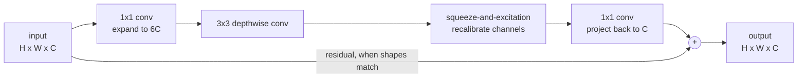

You have a ConvNet that works and a budget that just doubled. Do you add layers, widen the ones you have, or feed the network bigger images?

Before 2019 the answer was taste. ResNet scaled depth — ResNet-18 through ResNet-200. WideResNet scaled width. Others simply trained on larger crops. Each worked, each stalled, and nobody could say how the three traded off against one another.

EfficientNet's contribution is that the question has a *quantitative* answer, and that answer is one rule with three constants in it .

## The three knobs

<svg viewBox="0 0 620 190" role="img" aria-labelledby="scaling-dims-title" style="max-width:100%;height:auto">
  <title id="scaling-dims-title">A baseline network scaled three ways: wider layers, more layers, and higher input resolution</title>
  <g fill="none" stroke="currentColor" stroke-width="1.5">
    <rect x="14"  y="96" width="16" height="44" />
    <rect x="34"  y="88" width="16" height="60" />
    <rect x="54"  y="80" width="16" height="76" />
    <rect x="170" y="86" width="30" height="64" />
    <rect x="204" y="74" width="30" height="88" />
    <rect x="238" y="62" width="30" height="112" />
    <rect x="350" y="96" width="16" height="44" />
    <rect x="370" y="88" width="16" height="60" />
    <rect x="390" y="80" width="16" height="76" />
    <rect x="410" y="80" width="16" height="76" />
    <rect x="430" y="80" width="16" height="76" />
    <rect x="520" y="70" width="16" height="96" />
    <rect x="540" y="60" width="16" height="116" />
    <rect x="560" y="50" width="16" height="136" />
  </g>
  <g fill="currentColor" font-size="13" text-anchor="middle">
    <text x="42"  y="24">baseline</text>
    <text x="219" y="24">width (w)</text>
    <text x="398" y="24">depth (d)</text>
    <text x="548" y="24">resolution (r)</text>
  </g>
  <g fill="currentColor" font-size="11" text-anchor="middle" opacity="0.75">
    <text x="42"  y="44">what you have</text>
    <text x="219" y="44">more channels</text>
    <text x="398" y="44">more layers</text>
    <text x="548" y="44">bigger input</text>
  </g>
</svg>

Scaling **depth** captures richer, more abstract features, and is the dimension ResNet made famous. Scaling **width** — more channels per layer — captures finer-grained patterns and is easier to train. Scaling **resolution** gives the network more detail to work with in the first place.

The paper's first empirical result is that each of these, scaled alone, **saturates at around 80% top-1**. You can keep spending compute on depth long after depth has stopped paying for itself.

The second result is the interesting one. The dimensions are not independent. At higher resolution you *want* more layers, because a bigger image needs a larger receptive field to cover it, and you want more channels to hold the extra fine-grained detail. Scaling any one alone runs into the other two.

## The compound scaling rule

So scale all three together, governed by a single user-chosen coefficient:

$$d = \alpha^{\phi}, \qquad w = \beta^{\phi}, \qquad r = \gamma^{\phi}$$

subject to

$$\alpha \cdot \beta^{2} \cdot \gamma^{2} \approx 2, \qquad \alpha \ge 1, \; \beta \ge 1, \; \gamma \ge 1$$

Here $$\phi$$ is the knob you turn: it says *how much compute you have*. The three constants say *how to spend it*.

### Why width and resolution are squared

This is what the constraint is really about, and it is just FLOPs arithmetic.

A convolution layer's cost is proportional to the number of layers, times input channels times output channels, times the number of spatial positions. So:

- double the **depth** and you double the number of layers — FLOPs ×2
- double the **width** and both the input and output channel counts double — FLOPs ×4
- double the **resolution** and both the height and width of every feature map double — FLOPs ×4

Width and resolution are quadratic in FLOPs while depth is only linear, which is exactly the squares in the constraint. Total cost scales as

$$\text{FLOPs} \;\propto\; \left(\alpha \cdot \beta^{2} \cdot \gamma^{2}\right)^{\phi}$$

Pinning that product near 2 therefore makes the rule mean something clean: **total FLOPs go up by about $$2^{\phi}$$**. Ask for $$\phi = 3$$ and you have requested roughly 8× the compute, and the rule has already decided how to divide it.

### The constants

A small grid search on the baseline, holding $$\phi = 1$$, returns

$$\alpha = 1.2, \qquad \beta = 1.1, \qquad \gamma = 1.15$$

Check them against the constraint: $$1.2 \times 1.1^{2} \times 1.15^{2} = 1.2 \times 1.21 \times 1.3225 \approx 1.92$$, near enough to 2.

Note how modest they are. Per unit of $$\phi$$, depth grows 20%, width 10% and resolution 15% — and depth takes the largest share precisely *because* it is the cheap dimension in FLOPs.

The search runs once, on the small baseline, and the constants are then frozen. That is what makes the method practical: searching directly on a large model is prohibitively expensive, so the paper searches on the cheap one and extrapolates.

## The baseline matters

Compound scaling is a way of *growing* a network, so it can only be as good as what it starts from. Applying it to ResNet-50 does improve ResNet-50, but the headline numbers come from a better starting point: EfficientNet-B0, found by neural architecture search over the same space as MnasNet , optimising accuracy and FLOPs together.

Its building block is MBConv — the inverted residual bottleneck from MobileNetV2 , with a squeeze-and-excitation step added:

If that block looks familiar, it should. The depthwise separable convolution inside it is the same trick that makes MobileNet cheap, and the connection wrapping around it is ResNet's.

## What it buys

ImageNet single-crop accuracy , with comparable models interleaved:

| Model | Resolution | Params | FLOPs | Top-1 | Top-5 |
|---|---|---|---|---|---|
| **EfficientNet-B0** | 224 | 5.3M | 0.39B | 77.1% | 93.3% |
| ResNet-50  | 224 | 26M | 4.1B | 76.0% | 93.0% |
| **EfficientNet-B1** | 240 | 7.8M | 0.70B | 79.1% | 94.4% |
| ResNet-152  | 224 | 60M | 11B | 77.8% | 93.8% |
| **EfficientNet-B2** | 260 | 9.2M | 1.0B | 80.1% | 94.9% |
| Inception-v3  | 299 | 24M | 5.7B | 78.8% | 94.4% |
| **EfficientNet-B3** | 300 | 12M | 1.8B | 81.6% | 95.7% |
| **EfficientNet-B4** | 380 | 19M | 4.2B | 82.9% | 96.4% |
| **EfficientNet-B5** | 456 | 30M | 9.9B | 83.6% | 96.7% |
| **EfficientNet-B6** | 528 | 43M | 19B | 84.0% | 96.8% |
| **EfficientNet-B7** | 600 | 66M | 37B | 84.3% | 97.0% |
| GPipe | 480 | 557M | — | 84.3% | 97.0% |

The two rows carrying the argument are the first and the last. B0 beats ResNet-50 with **5× fewer parameters and 10× fewer FLOPs**. B7 matches GPipe's accuracy with **8.4× fewer parameters**, and the paper measures it at 6.1× faster inference.

Read down the EfficientNet rows and the compound rule is visible in the table itself: resolution, parameters and FLOPs all climb together, never one alone.

## What actually matters

**The load-bearing idea is the constraint, not the constants.** Pinning $$\alpha \cdot \beta^{2} \cdot \gamma^{2} \approx 2$$ is what converts "I have twice the compute" into one specific, reproducible architecture. The values 1.2, 1.1 and 1.15 are what a grid search happened to return for one baseline on one dataset; the *shape* of the rule is the transferable part.

**The common misreading is that EfficientNet is an architecture.** It is mostly a scaling *method*, plus one searched baseline. Compound scaling still beats single-dimension scaling when applied to ResNet or MobileNet — the paper shows exactly that. B0's architecture and the scaling rule are separable contributions, and conflating them is how people end up concluding "EfficientNet didn't reproduce for me" after swapping the baseline.

**Watch the resolution column before shipping.** B7 runs at 600×600, and FLOPs are not latency. Depthwise convolutions have poor arithmetic intensity and frequently underperform their FLOP count on real accelerators, which is part of why the follow-up work walked some of this back. A model that is 6.1× faster on the paper's hardware may not be on yours — measure it.

## Source code

- [`Transfer_learning_with_MobileNet_v1.ipynb`](https://github.com/danghoangnhan/cousera/tree/main/ConvolutionalNeuralNetworks/week2/W2A2) — builds the MBConv / MobileNetV2 block that EfficientNet-B0 is assembled from.

## References


