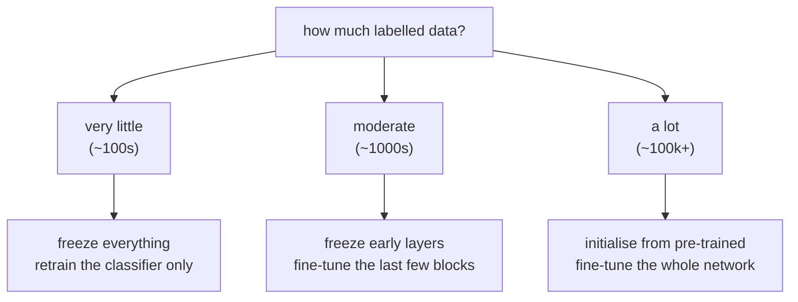

Almost nobody trains a vision network from random initialisation. ImageNet has 1.2 million labelled images ; your dataset has 500. The features a network learned on the former are mostly the features you need for the latter.

## Why it works at all

Early layers learn edges and colour blobs — general to essentially all natural images. Later layers learn increasingly task-specific combinations, until the final layer is entirely about the 1000 ImageNet classes .

The measurement behind this is worth knowing precisely. Freeze the first $$k$$ layers of an ImageNet network, retrain the rest on a different task, and plot accuracy against $$k$$: performance stays flat for small $$k$$ and degrades as $$k$$ grows, with the degradation appearing around the middle of the network . There is no sharp boundary between "general" and "specific" features — the transition is gradual, which is why "how much to freeze" is a dial and not a switch.

## How much to freeze

| Data | Freeze | Train | Learning rate |
|---|---|---|---|
| ~100s | all convolutional layers | new classifier head | normal |
| ~1,000s | early blocks | last blocks + head | reduced, ~10× lower |
| ~100,000s | nothing | everything | low, pre-trained as init |

Two rules that matter more than the exact boundaries:

**Always replace the final layer.** ImageNet's head outputs 1000 classes; yours does not. That layer is discarded and a new one initialised randomly, whatever else you do.

**Use a much lower learning rate when fine-tuning.** The pre-trained weights are already good. A normal learning rate on the first batch — while the randomly initialised head is producing large, meaningless gradients — will destroy them before they can help. This is the most common way transfer learning is made to fail. The standard fix is to train the head alone for an epoch or two with everything frozen, *then* unfreeze and continue at a low rate.

## The caching trick

If every layer up to some point is frozen, those layers compute the same thing on every epoch. Run the dataset through them **once**, save the activations to disk, and train the head directly on the saved features:

$$\text{images} \;\xrightarrow{\text{frozen network, once}}\; \text{feature vectors} \;\xrightarrow{\text{train, many epochs}}\; \text{classifier}$$

The training loop then touches a shallow head on small vectors instead of a deep network on images. For a fully frozen backbone this is often the difference between minutes and hours, and it works on a CPU.

The catch: it is incompatible with data augmentation. Augmentation makes each epoch see different pixels, so the cached activations would be wrong — see [part 20](/DataAugmentation/). Cache when the backbone is frozen *and* the inputs are fixed; otherwise pay for the forward pass.

## What actually matters

**Better ImageNet models are better starting points, but the correlation is weaker than it looks.** Across ImageNet architectures, top-1 accuracy correlates with transfer performance — yet the ranking is not preserved on every downstream task, and the advantage largely disappears when the target dataset is large enough to train from scratch . Picking the top of the ImageNet leaderboard as a backbone is a reasonable default, not a guarantee.

**Domain distance is what actually decides how much to freeze, and dataset size is a proxy for it.** ImageNet is photographs of objects. Transferring to more photographs of objects works extremely well. Transferring to greyscale medical scans, satellite imagery or document scans works much less well, because even the early features are somewhat wrong — natural-image colour statistics do not apply. With a distant domain, fine-tune more of the network than the dataset size alone would suggest, and treat "ImageNet pre-training always helps" as false in that regime.

**Batch normalisation makes "frozen" ambiguous.** A frozen BN layer still updates its running mean and variance in training mode unless explicitly told not to, so a "frozen" backbone can silently drift and degrade — especially with small batches. Set the BN layers to inference mode when freezing. This is a real and frequently hit bug, not a theoretical concern.

## Source code

- [`Transfer_learning_with_MobileNet_v1.ipynb`](https://github.com/danghoangnhan/cousera/tree/main/ConvolutionalNeuralNetworks/week2/W2A2) — loads MobileNetV2 pre-trained on ImageNet, replaces the head, trains with the base frozen, then unfreezes the last layers at a reduced learning rate. It also sets `training=False` on the base model, which is the batch-norm point above.

## References


