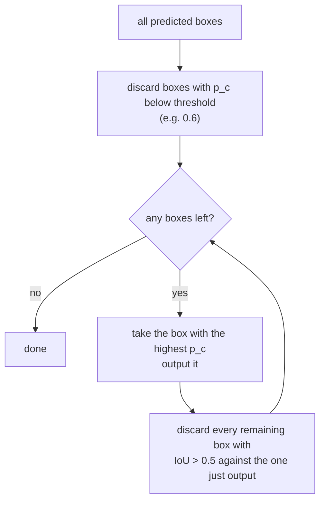

A detector run over an image does not produce one box per object. It produces one prediction per grid cell per anchor — often tens of thousands — and the cells *near* an object all fire, because a cell one step over still sees most of the car.

So a single car yields a dozen overlapping boxes with high confidence. Non-max suppression is the standard fix : keep the most confident box, delete everything that overlaps it too much, repeat.

## The algorithm

Written out, for a single class:

1. Drop every box whose confidence $$p_c$$ is below a threshold — this removes the overwhelming majority cheaply.
2. While boxes remain:
   - pick the box $$b^\star$$ with the highest $$p_c$$ and **keep** it;
   - remove every remaining box $$b$$ with $$\text{IoU}(b, b^\star) > \tau$$.

Two thresholds, doing different jobs:

| Threshold | Typical | Controls |
|---|---|---|
| Confidence $$p_c$$ | 0.6 | how sure the detector must be to propose anything |
| IoU $$\tau$$ | 0.5 | how much overlap counts as "the same object" |

Raising $$\tau$$ keeps more boxes (fewer are considered duplicates); lowering it suppresses more aggressively.

## Run it per class

This detail is skipped surprisingly often. NMS must run **independently for each class**.

A person standing in front of a car produces a person box and a car box with high mutual IoU. Class-agnostic NMS deletes one of them — a real object silently lost. Because the two detections are different classes, they are not duplicates and must not compete.

So the loop above runs once per class, over that class's boxes only.

## What actually matters

**NMS is the standard failure mode in crowded scenes, and it is structural.** Two genuinely distinct objects of the same class that overlap heavily — one person partly behind another, cars in dense traffic — will have high IoU with each other. NMS cannot tell that from a duplicate detection and deletes the occluded one. Lowering $$\tau$$ makes it worse; raising it lets real duplicates through. There is no threshold that fixes crowds, because the algorithm's core assumption (high overlap implies same object) is simply false there.

Soft-NMS addresses this by *decaying* a box's confidence in proportion to its overlap rather than deleting it outright, so a heavily overlapping but very confident box can survive . It is a one-line change and typically worth a point of mAP on crowded datasets.

**It is a non-differentiable post-processing step, and that is architecturally significant.** NMS sits outside the network: the model is trained on raw predictions and NMS is applied afterwards, so the loss never sees it. This means the detector is not optimised end to end for the output you actually consume — a mismatch that motivated later detectors like DETR, which remove NMS entirely by making the model emit a set of predictions directly.

**It is often a real latency cost.** NMS is sequential by construction — each iteration depends on the previous one — and on tens of thousands of boxes it can rival the network's own inference time on fast hardware. Production detectors cap the number of boxes entering NMS, which is a silent recall ceiling worth knowing about when a model mysteriously misses objects in busy images.

## References


