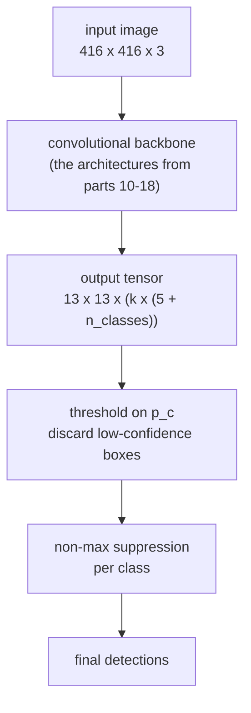

Everything in this series, assembled. YOLO is a convolutional backbone, a grid, anchor boxes, IoU and non-max suppression, arranged so that detection is **one forward pass** .

The name is the claim: you only look once. Prior detectors ran a classifier at many locations and scales, or generated region proposals and classified each . YOLO makes detection a single regression from image to tensor.

The sliding-window half of that history is worth one note, because it is the same insight arriving early: OverFeat showed that running a classifier at every window is equivalent to one convolutional pass over the whole image, since the fully connected layers can be rewritten as convolutions . Shared computation across overlapping windows is what makes a dense grid of predictions affordable at all.

## The pipeline

Note where the network stops. Everything after the output tensor — thresholding and NMS — is post-processing, outside the model and outside the loss.

## The output tensor

The image is divided into an $$S \times S$$ grid. Each cell predicts $$k$$ boxes, each carrying a confidence, four coordinates and the class scores:

$$S \times S \times \big(k \times (5 + n_{\text{classes}})\big)$$

For a 13×13 grid, 5 anchors and 80 COCO classes: $$13 \times 13 \times 425 = 71{,}825$$ numbers, describing 845 candidate boxes.

Crucially the grid is not a separate mechanism — it *is* the feature map. A 416×416 image through a backbone with five stride-2 stages comes out at 13×13, and each of those 169 positions is one grid cell. The "grid" is the spatial dimension of the final convolutional layer, which is why the whole thing is one pass.

## Parameterising the box

The obvious approach — have the network output $$b_x, b_y, b_h, b_w$$ directly — trains badly. Early in training the predictions are arbitrary, boxes land anywhere in the image, and the model takes a long time to stabilise.

YOLOv2 constrains the prediction to the cell instead . The network outputs $$t_x, t_y, t_w, t_h$$, and:

$$b_x = \sigma(t_x) + c_x, \qquad b_y = \sigma(t_y) + c_y$$

$$b_w = p_w e^{t_w}, \qquad b_h = p_h e^{t_h}$$

where $$(c_x, c_y)$$ is the cell's top-left corner and $$(p_w, p_h)$$ is the anchor's shape.

Two design decisions worth reading carefully:

- **The sigmoid on the centre** forces $$\sigma(t) \in (0,1)$$, so a cell's predicted midpoint cannot leave that cell. The assignment rule from [part 24](/anchorboxes/) said the cell containing the midpoint owns the object; this makes that property hold by construction rather than by hope.
- **The exponential on the size** guarantees a positive width and height, and makes the network predict a *multiplier* on its anchor rather than an absolute size. Predicting "1.1× the usual car" is a far easier regression than predicting 87 pixels, and it is why good anchor shapes matter.

This one change was worth about 5 mAP over direct prediction.

## Confidence

$$p_c$$ is not simply "is there an object". It is trained toward

$$p_c = \Pr(\text{object}) \times \text{IoU}(\text{predicted}, \text{truth})$$

so the confidence reflects *localisation quality* as well as presence. A box that finds the right object but frames it badly should not be confident, and this is what makes the confidence a sensible thing to rank by in NMS.

The final score used for each class is

$$\text{score} = p_c \times \Pr(\text{class}_i \mid \text{object})$$

which is what gets thresholded and fed to [non-max suppression](/non-max-suppression/).

## Why one pass matters

| Detector | mAP (VOC 2007) | FPS |
|---|---|---|
| R-CNN  | 66.0 | 0.05 |
| Faster R-CNN (VGG-16)  | 73.2 | 7 |
| YOLO  | 63.4 | 45 |
| YOLOv2 (416)  | 76.8 | 67 |

The original YOLO traded accuracy for a 6× speed-up over Faster R-CNN. YOLOv2 gave the accuracy back — anchor boxes, the box parameterisation above, batch normalisation  and higher-resolution training — while getting faster still.

At 0.05 FPS, R-CNN takes 20 seconds per image. At 67 FPS, YOLOv2 runs faster than video. That is not a better number on the same axis; it is the difference between a research result and something you can point at a camera.

## What actually matters

**One pass is why it is fast, and also why it struggles with small objects.** Every object competes for a slot on a coarse grid. At 13×13, a flock of birds or a crowd at distance maps many objects onto few cells, and [anchors](/anchorboxes/) only partly help because those objects also have similar shapes. This is a structural consequence of the design, addressed later by predicting at several scales at once rather than by any change to the loss.

**Most of what makes YOLO work is not in the YOLO paper.** The backbone is the architecture line from [parts 10 to 18](/classic-networks-lenet-alexnet-vgg/); batch normalisation, anchor shapes from k-means, and multi-scale training arrived in v2; the training recipe matters as much as any of it. Reading the v1 paper alone tells you about the framing, not about what makes a modern one-stage detector accurate.

**NMS being outside the network is the design's clearest weak point.** The loss optimises the raw tensor; the output you consume has been through a non-differentiable, sequential, threshold-dependent filter that the model never sees. Every mistake NMS makes in a crowd is a mistake the model was never given a chance to learn around. That gap is exactly what set-prediction detectors were built to close.

## Source code

- [`tf2_object_detection.ipynb`](https://github.com/danghoangnhan/cousera-tf_advance/blob/main/Course3/tf2_object_detection.ipynb) — runs pre-trained detectors end to end, where the output tensor, the score threshold and the NMS step are all visible as separate stages.

## References


