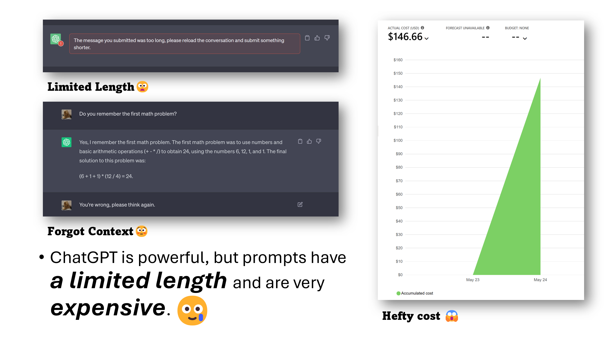
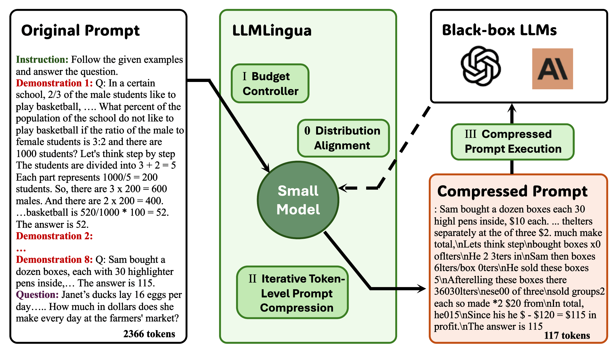

# LLMLingua: Compressing Prompts for Accelerated Inference of Large Language Models

### The Challenges of of LLMs

Large language models (LLMs) have revolutionized various applications due to their remarkable capabilities. Advancements in techniques like chain-of-thought prompting and in-context learning have significantly enhanced the ability of LLMs to perform complex reasoning tasks and adapt to specific domains. However, these powerful techniques often result in increasingly long prompts, comprising tens of thousands of tokens.
This trend toward lengthy prompts presents a significant challenge. It leads to substantial computational demands and increased costs for LLM inference, hindering the broader adoption and scalability of LLMs in real-world applications. This situation has created an urgent need to balance the need for comprehensive prompts with the computational efficiency of LLMs.

In addition to the challenges posed by lengthy prompts, several inherent limitations of LLMs further underscore the need for innovative solutions:

- Token Limits: LLMs are inherently constrained by token limits, which restrict their ability to handle very long texts . This limitation can be particularly problematic when dealing with tasks that require summarizing lengthy documents or processing extensive conversational histories, as exceeding the token limit can result in information loss .
- High API Costs: LLMs like GPT-3.5 and GPT-4, while demonstrating impressive performance, come with substantial API costs . These costs can become prohibitive for large-scale experiments, research endeavors, or applications that require frequent interaction with the LLM.

## How LLMLingua Works

LLMLingua streamlines large language model prompts through three essential components: the Budget Controller for optimal compression allocation, Iterative Token-Level Prompt Compression (ITPC) for context-aware compression, and Distribution Alignment to maintain model consistency.

### Budget Controller

The Budget Controller  manages compression across different prompt components. This module:

- Dynamically assigns varying compression ratios based on content importance
- Prioritizes preservation of instructions and questions over demonstrations
- Operates at sentence level to maintain linguistic coherence
- Adapts compression rates based on content criticality and available token budget

**Input:**

- A small language model $$ \mathcal{M}_s $$
- The original prompt $x = (x^{\text{ins}}, x^{\text{dems}}, x^{\text{que}})$

**Equation:**

Compression ratio for demonstrations(Equation 2):

- $$\tau_{\text{dems}} = \frac{\tau L - (\tau_{\text{ins}}L_{\text{ins}} + \tau_{\text{que}}L_{\text{que}})}{L_{\text{dems}}}$$ (2)
- Where:
    $\tau$, $L$: the compression ratio and length for prompt
    $\tau_{\text{dems}}$, $L_{\text{dems}}$: the compression ratio and length for demonstrations
    $\tau_{\text{ins}}$, $L_{\text{ins}}$: the compression ratio and length for instructions
    $\tau_{\text{que}}$, $L_{\text{que}}$: the compression ratio and length for questions

Compression Ratio Adjustment (Equation 3):

- $\Delta \tau = \frac{k \tau_{\text{dems}}L_{\text{dems}} - \tilde{L}_D}{L_{\text{ins}} + L_{\text{que}}}$
- Where:
    $\Delta \tau$ is the adjustment to the compression ratio
    $k$ is a scaling factor
    $\tau_{\text{dems}}$: the compression ratio and length for demonstrations
    $L_{\text{dems}}$: the length processed by the lens model
    $\tilde{L}_D$:  the desired compressed length
    $L_{\text{ins}}$ , $L_{\text{que}}$ : lengths of instructions and questions respectively

**Algorithm:**

1. Set the selected demonstration set $\mathcal{D} = \phi$
2. Get demonstration compression rate $\tau_{\text{dem}}$ by Eq.(2)
3. Calculate the perplexity of each demonstration via $\mathcal{M}_s$
4. Rank all demonstrations in descending order of their perplexity as a list $(x_{(1)}^{\text{dem}}, ..., x_{(N)}^{\text{dem}})$, where $N$ is the number of demonstrations, $x_{(i)}^{\text{dem}}$ is the $i$-th demonstration
5. **for** $i = 1$ **do**
6. &nbsp;&nbsp;&nbsp;&nbsp;**if** $L_\mathcal{D} > k \cdot \tau_{\text{dems}}L_{\text{dems}}$ **then**
7. &nbsp;&nbsp;&nbsp;&nbsp;&nbsp;&nbsp;&nbsp;&nbsp;Break
8. &nbsp;&nbsp;&nbsp;&nbsp;**end if**
9. &nbsp;&nbsp;&nbsp;&nbsp;Append $x_{(i)}^{\text{dem}}$ to $\mathcal{D}$
10. &nbsp;&nbsp;&nbsp;&nbsp;$i = i + 1$
11. **end for**
12. Allocate remaining budget to $x^{\text{ins}}$ and $x^{\text{que}}$ via Eq. (3)

**Output:**

- The subset of demonstrations $\mathcal{D}$ obtained from coarse-grained compression
- Additional budget $\Delta\tau_{\text{ins,que}}$ for the instruction and the question

### Iterative Token-Level Prompt Compression

ITPC implementing a sophisticated, context-aware approach:

- Segments prompts into meaningful units for targeted compression
- Considers token interdependencies during compression decisions
- Iteratively refines compression to preserve semantic relationships
- Maintains critical context that basic token-level compression might miss

**Input:**

- A small language model $\mathcal{M}_s$
- The prompt from budget controller $x' = (x^{\text{ins}}, x^{\mathcal{D}}, x^{\text{que}})$
- Target compression rate $\tau$
- Adjusted compression rate $\Delta\tau_{\text{ins,que}}$

**Algorithm:**

1. Set the selected token set $\mathcal{T} = \phi$
2. Get segment set $\mathcal{S}$
3. **for** $i = 1,2,\ldots,m$ **do**
4. &nbsp;&nbsp;&nbsp;&nbsp;Get the conditional probabilities $p(s_i)$ via Eq.(5)
5. &nbsp;&nbsp;&nbsp;&nbsp;Get the compression threshold $\gamma_i$ with Eq. (6)
6. &nbsp;&nbsp;&nbsp;&nbsp;Append the compressed token to $\mathcal{T}$ via Eq.(7)
7. **end for**
8. Concatenate all tokens in $\mathcal{T}$ as $\tilde{x}$

**Output:** The compressed prompt $\tilde{x}$

### Distribution Alignment

 A pre-trained small language model $\mathcal{M}_s$ and use the data generated by the LLM to perform instruction tuning on $\mathcal{M}_s$. The optimization of $\mathcal{M}_s$ can be formulated as:

$\min_{\theta_s} \mathbb{E}\left[\frac{1}{N}\sum_{i=1}^N \mathcal{L}(x_i, y_{i,\text{LLM}}; \theta_{\mathcal{M}_s})\right]$, &nbsp;&nbsp;&nbsp;&nbsp; (8)

where :

- $\theta_{\mathcal{M}_s}$: the parameters of $\mathcal{M}_s$
- $(x_i, y_i^{\text{LLM}})$: the pair of instruction $x_i$ and the LLM generated texts $y_i^{\text{LLM}}$
- $N$ is the number of all examples used for instruction tuning.

### Key Features and Advantages

- **State-of-the-art Performance:** LLMLingua consistently outperforms existing prompt compression methods, including GPT4-Generation, Random Selection, and Selective-Context. It achieves this while enabling impressive compression ratios (up to 20x), showcasing its ability to retain critical information from the original prompt.
- **Retention of Reasoning and ICL Capabilities:** LLMLingua effectively preserves the reasoning and in-context learning capabilities of LLMs, even at high compression ratios.
- **Generalizability Across Different LLMs**: The effectiveness of LLMLingua extends beyond the GPT family of models, as demonstrated by its successful implementation with Claude-v1.3 as the target LLM.
- **Compatibility with Different Small LMs**: Although the choice of the smaller language model can impact performance, LLMLingua's design enables its adaptation to various smaller LMs, with satisfactory results achieved even with less powerful models like GPT2-Small.
- **Reduction in Generated Text Length**: Prompt compression not only saves computational resources in the input but also contributes to reduced computation in the generation stage, as evidenced by the shorter text length produced by LLMs when using compressed prompts.

### Practical Implications

- **Cost Reduction:** LLMLingua leads to significant cost savings by reducing the number of tokens processed during inference, a crucial factor considering the token-based pricing models of LLMs.
- **Enabling Longer Contexts:** By compressing prompts, LLMLingua opens up possibilities for accommodating longer contexts in LLMs, potentially enhancing their performance on tasks requiring extensive background information.
- **Potential for Downstream Task Performance Improvement:** By allowing the compression of longer prompts, LLMLingua holds the potential to enhance downstream task performance, enabling the utilization of more comprehensive prompts without incurring excessive computational costs.
- **Improved LLM Inference Efficiency:** LLMLingua's prompt compression can contribute to improved LLM inference efficiency by compressing the KV cache, further optimizing the resource utilization during model inference.

### Limitations

While LLMLingua delivers significant advantages, it's essential to acknowledge its limitations:

- **Performance Drop at Extreme Compression Ratios:** While LLMLingua mitigates performance decline at high compression ratios, exceeding certain thresholds (e.g., 25x-30x on GSM8K) can still lead to a substantial performance drop. The achievable compression ratio depends on various factors like prompt length, task type, and the number of sentences involved.
- **Tokenizer Discrepancies:** The potential for subtle differences between the tokenizers used by the smaller and target LLMs might lead to an underestimation of the prompt's token length, impacting the accuracy of compression calculations.
