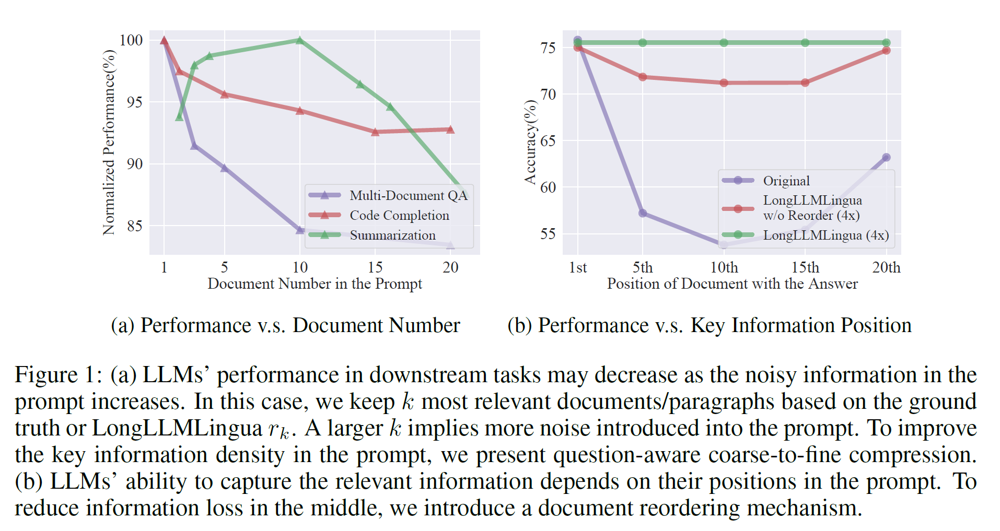

# LongLLMLingua Model: A Solution for LLMs in Long Context Scenarios

## Core Challenges



### 1. Question-Context Relevance Problem

Traditional prompt compression methods face several critical issues when dealing with long contexts:

```plaintext
Traditional Approach:
Input: [Document1, Document2, ..., DocumentN] + Question
Process: Compress each document independently
Problem: Lost relationship between question and relevant content
```

This leads to:

- Information loss from relevant sections
- Retention of irrelevant information
- Suboptimal compression ratios

### 2. Position Bias

LLMs exhibit significant position bias in processing long sequences:

```plaintext
Typical LLM Processing:
Beginning of prompt: High attention & retention
Middle of prompt: Decreased attention
End of prompt: Recency bias
```

Impact:

- Critical information in middle sections gets overlooked
- Uneven quality of responses based on information position
- Inefficient use of context window

### 3. Static Compression Limitations

Current compression methods often use fixed compression ratios:

# LongLLMLingua Methodology

## 1. Question-Aware Coarse-to-Fine Compression

### Coarse-Grained Stage

The first stage focuses on document-level relevance assessment:

1. **Ranking Metric (rk)**
   - Evaluates document-question association strength
   - Calculates question perplexity conditioned on each document
   - Higher rk indicates stronger relevance to the question

2. **Hallucination Prevention**
   - Appends restrictive statements after questions
   - Example: "We can get the answer to this question in the given documents"
   - Reinforces connection between question and context
   - Reduces model tendency to hallucinate

### Fine-Grained Stage

After identifying relevant documents, the process moves to token-level analysis:

1. **Contrastive Perplexity Evaluation**
   - Measures token importance relative to the question
   - Compares token perplexity with and without question context
   - Identifies question-relevant tokens

2. **Token Selection Process**
   - Prioritizes tokens with high contrastive perplexity
   - Maintains semantic coherence
   - Preserves question-relevant information

## 2. Document Reordering System

### Position Bias Mitigation

1. **Importance-Based Ordering**
   - Ranks documents using rk scores
   - Places high-relevance documents strategically
   - Addresses "lost in the middle" phenomenon

2. **Attention Distribution**
   - Optimizes document sequence for LLM processing
   - Ensures critical information receives adequate attention
   - Maintains logical flow and coherence

## 3. Dynamic Compression Ratio Allocation

### Adaptive Compression

1. **Importance-Based Ratios**
   - Higher importance → Lower compression ratio
   - Lower importance → Higher compression ratio
   - Preserves more content from relevant documents

2. **Budget Distribution**
   - Allocates token budget based on document relevance
   - Balances compression across document set
   - Optimizes information retention

## 4. Subsequence Recovery

### Entity Preservation

1. **Entity Detection**
   - Identifies compressed named entities
   - Recognizes important technical terms
   - Maps abbreviated references

2. **Recovery Process**
   - Restores original entity forms
   - Maintains contextual accuracy
   - Ensures output coherence

## Implementation Flow

### 1. Initial Processing

- Parse input documents and question
- Prepare for coarse-grained analysis
- Set up compression parameters

### 2. Coarse Compression

- Calculate document-question relevance
- Apply ranking metric (rk)
- Select relevant documents

### 3. Document Organization

- Reorder based on importance scores
- Optimize position distribution
- Prepare for fine-grained compression

### 4. Fine-Grained Processing

- Calculate contrastive perplexity
- Apply dynamic compression ratios
- Select relevant tokens

### 5. Post-Processing

- Recover important subsequences
- Verify entity consistency
- Ensure output quality

## Optimization Considerations

### 1. Performance Enhancement

- Batch processing for efficiency
- Optimal window sizing
- Resource utilization management

### 2. Quality Assurance

- Coherence verification
- Entity accuracy checking
- Semantic consistency validation

## System Requirements

### 1. Model Components

- Small language model for perplexity calculation
- Entity recognition system
- Compression ratio calculator

### 2. Resource Requirements

- Memory allocation for document processing
- Storage for entity mapping
- Processing capacity for real-time compression

## Methodology Benefits

1. **Enhanced Accuracy**
   - Question-aware compression preserves relevant information
   - Dynamic ratios optimize content retention
   - Entity recovery maintains precision

2. **Improved Efficiency**
   - Reduced token count
   - Optimized processing flow
   - Minimized computational overhead

3. **Better Context Handling**
   - Position bias mitigation
   - Coherent document organization
   - Preserved semantic relationships

## Limitations and Considerations

1. **Question-Specific Nature**
   - Requires recompression for new questions
   - Limited caching potential
   - Computational overhead for repeated processing

2. **Complex Relationships**
   - May miss subtle context connections
   - Challenges with intricate document dependencies
   - Potential for information loss in edge cases

This methodology represents a comprehensive approach to long-context prompt compression, balancing efficiency with effectiveness while maintaining output quality and relevance.
