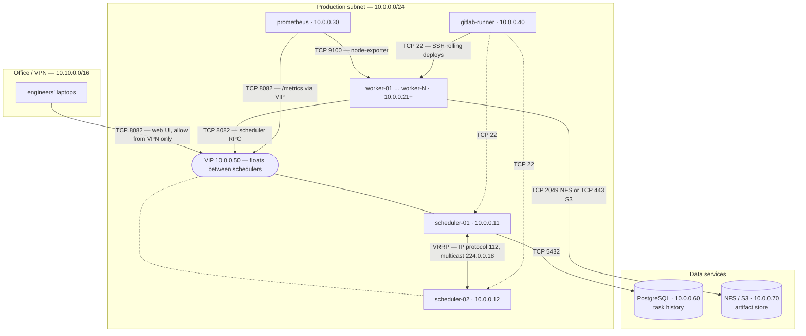
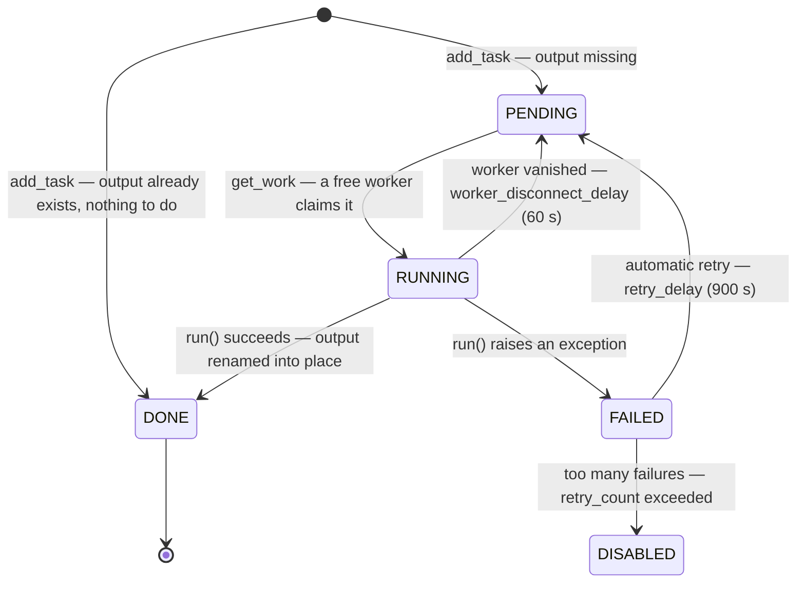
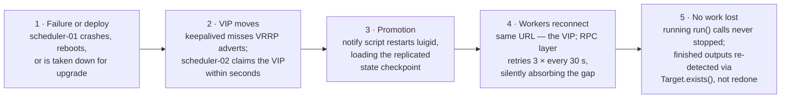
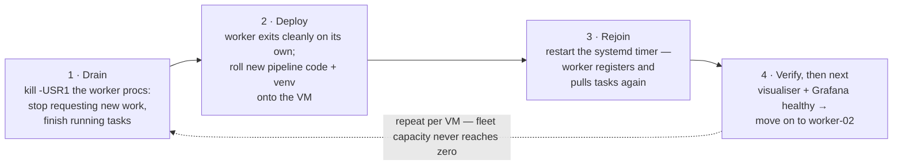
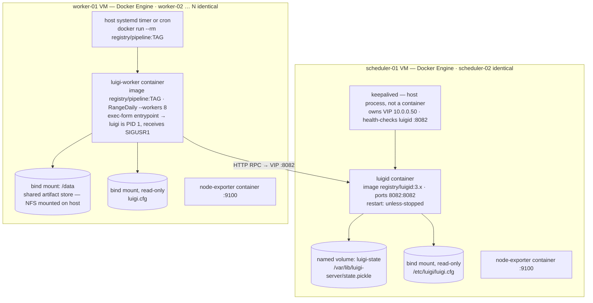
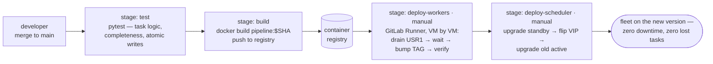

Every data team I know has the same origin story. One cron job, on one VM, running one Luigi pipeline. It works beautifully — right up until the night the VM reboots mid-run, the morning report doesn't arrive, and you spend breakfast SSH-ed into a box re-running tasks by hand.

This post is the story of what comes next: growing that single box into a small fleet — multiple worker servers, a highly-available `luigid` scheduler, a network layout you can explain to your security team, a CI/CD pipeline on GitLab that deploys all of it with zero downtime — and, most importantly, *why* each piece is shaped the way it is.

<!--more-->

## The cast of characters

Before any diagrams, meet the actors. It makes everything else obvious.

**The scheduler (`luigid`) is a site foreman with a clipboard.** He decides who builds what, in which order, and he never, ever lifts a brick himself. This is the single most important fact about Luigi: the central scheduler executes nothing. If the foreman goes home early, the crew already working keeps working — nobody drops a wall halfway.

**Workers are the crew.** Interchangeable, numerous, and honestly a bit expendable. Any worker can do any task, and if one goes home sick, another picks up his job tomorrow. All the real work — every `run()` method — happens here.

**The artifact store is the warehouse.** NFS, HDFS, or S3 — wherever task outputs live. Here is Luigi's quiet superpower: the question "is this task done?" is never answered from anyone's memory. It's answered by walking into the warehouse and checking whether the box is on the shelf (`Target.exists()`). Memories crash and reboot; shelves don't.

**The VIP is the phone number.** A single floating IP (managed by keepalived) that always rings whichever foreman is on duty. Workers, browsers, and monitoring all dial the same number and never need to know which physical machine answered.

## The system architecture



Two small VMs run `luigid`, but only the one holding the VIP is *active*. The standby idles, receiving a copy of the scheduler's state checkpoint (`state.pickle`, rsync-ed every minute or on a shared/DRBD disk). The task-history database (PostgreSQL) records every task event durably, and Prometheus scrapes metrics through the VIP so monitoring survives failovers without noticing them.

The worker fleet is N identical VMs. Each one runs the same pipeline codebase and a systemd timer that fires the entrypoint — a `WrapperTask` or `RangeDaily --of NightlyPipeline` — with `--workers 8`. And here's the trick that makes scaling trivial: *every* VM submits the *same* task graph. The scheduler deduplicates, hands each pending task to exactly one worker, and adding throughput is literally "clone another VM." No leader election, no partitioning scheme, no coordination code.

Why not two active schedulers? Because `luigid` is a single process by design — no clustering, no replication. Instead of fighting that, we make the scheduler *disposable*: the real source of truth is the warehouse plus the history database. If the scheduler's memory were wiped entirely, the next timer tick re-submits the graph, every task whose output sits on the shelf is skipped, and life continues. You lose a little context (retry counters), never work.

## The network layer



The firewall story is short, and short firewall stories are good firewall stories.

**Workers never listen. They only dial out.** A worker VM needs zero inbound ports (SSH from the deploy runner aside) — it dials the scheduler, dials the storage, dials the SMTP relay. That one sentence removes half of a security review.

| From | To | Port / protocol | Why |
|---|---|---|---|
| Workers, laptops (VPN), Prometheus | VIP `10.0.0.50` | `8082/tcp` | Scheduler RPC, web UI, `/metrics` |
| scheduler-01 ⇄ scheduler-02 | each other | VRRP (IP protocol 112, multicast `224.0.0.18`) | keepalived heartbeats — allow it or the VIP flaps |
| Active scheduler | PostgreSQL | `5432/tcp` | Task history |
| Workers | NFS / S3 | `2049/tcp` or `443/tcp` | Read inputs, write outputs |
| Prometheus | every VM | `9100/tcp` | node-exporter |
| GitLab Runner | every VM | `22/tcp` | Rolling deploys |

Expose exactly one thing to humans: the VIP on 8082, and only from the office/VPN range. Everything else is machine-to-machine inside the production subnet. The only exotic line is VRRP — it's not TCP, it's IP protocol 112 on a multicast address, and forgetting to allow it is the classic "why does my VIP bounce every three seconds" incident.

## The life of a task



Let me tell you about one task's day. Call her `SalesReport(date=2026-08-01)`.

At 02:00, a timer fires on worker-03 and submits the nightly graph. The worker first checks the warehouse — `SalesReport`'s output isn't on the shelf — so she registers with the foreman as **PENDING**. Worker-07 happens to finish something and asks the foreman for work (`get_work`); the foreman hands over `SalesReport`, and she is now **RUNNING** — on worker-07, a machine that had nothing to do with submitting her.

Her `run()` writes results to a *temporary* path, and only after the last byte lands does an atomic rename put the box on the shelf. She becomes **DONE** — permanently, provably: any future submission of the graph will see her output and skip her.

The interesting days are the bad ones. If `run()` throws, she goes to **FAILED**, and the scheduler automatically retries her after `retry_delay` (15 minutes) — transient errors need no humans. If worker-07 loses power mid-write, the scheduler notices the missed heartbeats after `worker_disconnect_delay` (60 seconds) and returns her to **PENDING** for another worker; the half-written temp file never touched the real shelf, so nothing downstream can consume garbage. And if she fails too many times (`retry_count`), she's parked as **DISABLED** so a broken task can't retry-storm the cluster while everyone sleeps.

That's the whole system's resilience in one biography: *state lives in outputs, writes are atomic, everything else is retryable.*

## When the scheduler dies (zero downtime, part one)



At some point scheduler-01 will die — a kernel panic, a bad disk, or you, on purpose, at 14:00 on a Tuesday, because upgrades shouldn't be scary.

keepalived notices the missed VRRP heartbeats within seconds and moves the VIP to scheduler-02, whose promotion script (re)starts `luigid` from the freshest replicated state checkpoint. And the workers? They dial the same phone number they always dialed. Luigi's RPC client retries a failed call three times with a 30-second wait (`[core] rpc_retry_attempts` / `rpc_retry_wait`), so the fleet silently absorbs an outage of a minute and a half — a keepalived flip takes three seconds. Tasks that were RUNNING never even notice, because the foreman never had their bricks in his hands to begin with.

> **The upgrade trick:** make failover the deploy mechanism. Upgrade the *standby* first, deliberately flip the VIP to it, verify, then upgrade the former active. The VIP is never unowned for more than seconds, and you always keep one known-good scheduler to fail back to.

## Deploying workers without dropping a task (part two)



Workers deploy like a rolling wave, one VM at a time, and Luigi has a first-class drain built in: send `SIGUSR1` to a worker process and it stops asking for new work, finishes what it's running, and exits by itself. Drain, deploy, rejoin, verify, next VM. Fleet capacity never touches zero, and no task is ever killed mid-flight.

And if a VM dies *ungracefully* mid-deploy? Reread the task lifecycle above — the safety net doesn't care why a worker vanished. Rolling deploys are for smoothness, not for correctness.

## What actually runs on each box



Containerizing this changes *how software gets onto a box*, not the architecture. On scheduler VMs, `luigid` is a long-lived container (`restart: unless-stopped`) with the state checkpoint on a named volume and `luigi.cfg` bind-mounted read-only; keepalived stays a host process because VRRP wants to own real network interfaces. On worker VMs, the pipeline ships as an *immutable image*: the host timer runs `docker run --rm registry/pipeline:TAG`, so nothing on the box ever mutates — a deploy is a tag bump. The drain becomes `docker kill --signal=USR1` (use an exec-form ENTRYPOINT so Luigi is PID 1 and actually receives the signal), and the NFS mount lives on the host, bind-mounted in, keeping credentials out of images.

## Shipping it all with GitLab CI/CD



The last mile: nobody should SSH around the fleet by hand. A GitLab Runner (shell executor, on its own small VM inside the production subnet, with SSH keys to the fleet) turns the whole rolling-deploy choreography into a button.

```yaml
stages: [test, build, deploy]

variables:
  IMAGE: $CI_REGISTRY_IMAGE/pipeline
  TAG: $CI_COMMIT_SHORT_SHA

test:
  stage: test
  image: python:3.11
  script:
    - pip install -r requirements.txt
    - pytest tests/            # task logic, completeness, atomic-write discipline

build:
  stage: build
  tags: [luigi-deploy]         # our shell runner
  script:
    - docker build -t $IMAGE:$TAG .
    - docker login -u $CI_REGISTRY_USER -p $CI_REGISTRY_PASSWORD $CI_REGISTRY
    - docker push $IMAGE:$TAG

deploy-workers:
  stage: deploy
  when: manual                 # a human presses the button
  environment: production
  tags: [luigi-deploy]
  script:
    - |
      for host in worker-01 worker-02 worker-03; do
        echo "── rolling $host"
        # 1. drain: stop taking new tasks, finish running ones
        ssh luigi@$host "docker kill --signal=USR1 luigi-worker || true"
        # 2. wait for the container to exit on its own
        ssh luigi@$host "while docker ps -q -f name=luigi-worker | grep -q .; do sleep 15; done"
        # 3. bump the tag the systemd timer will use next tick
        ssh luigi@$host "echo TAG=$TAG | sudo tee /etc/luigi/image.env && docker pull $IMAGE:$TAG"
        # 4. verify the scheduler still sees a healthy fleet before moving on
        curl -fsS http://10.0.0.50:8082/ > /dev/null
      done

deploy-scheduler:
  stage: deploy
  when: manual
  needs: [deploy-workers]
  tags: [luigi-deploy]
  script:
    - ssh luigi@scheduler-02 "docker pull $CI_REGISTRY_IMAGE/luigid:$TAG && sudo systemctl restart luigid"
    - ssh luigi@scheduler-01 "sudo systemctl stop keepalived"    # VIP flips to 02
    - sleep 5 && curl -fsS http://10.0.0.50:8082/ > /dev/null    # health check via VIP
    - ssh luigi@scheduler-01 "docker pull $CI_REGISTRY_IMAGE/luigid:$TAG && sudo systemctl restart luigid && sudo systemctl start keepalived"
```

Notice how little cleverness the pipeline contains. It doesn't migrate state, doesn't pause the world, doesn't coordinate anything — because the architecture already guarantees that draining a worker loses nothing and flipping the VIP interrupts nobody. Good CI/CD for this system is mostly *pressing the buttons in the right order*, and that's exactly how it should feel. The manual gates are deliberate: tests and builds run on every merge, but a human decides when the fleet rolls.

## The safety net, restated

Everything above leans on four properties — and they're obligations on your *pipeline code*, not gifts from the infrastructure. Completeness is output-based, so finished work can never be forgotten or redone. Writes are atomic via `temporary_path()`, so a dying worker cannot leave a half-truth on the shelf. Dead workers are detected (60 s) and their tasks re-queued; failed tasks retry themselves (15 min). And global `[resources]` limits are enforced by the scheduler *across the whole fleet*, so ten workers can't accidentally open three hundred database connections or write the same file twice.

Get those four right and every failure in this post becomes boring. Boring is the goal.

## Configuration cheat-sheet

| Setting | Section | Default | Role in this design |
|---|---|---|---|
| `default_scheduler_url` | `[core]` | `http://localhost:8082/` | Point at the **VIP**, never a physical host |
| `rpc_retry_attempts` / `rpc_retry_wait` | `[core]` | 3 / 30 s | Workers ride out ~90 s of scheduler downtime |
| `state_path` | `[scheduler]` | `/var/lib/luigi-server/state.pickle` | The checkpoint you replicate to the standby |
| `record_task_history` + `[task_history] db_connection` | `[scheduler]` | off | Durable audit trail in PostgreSQL |
| `worker_disconnect_delay` | `[scheduler]` | 60 s | How fast a dead worker's tasks are re-queued |
| `retry_delay` / `retry_count` | `[scheduler]` | 900 s | Automatic retries; park broken tasks as DISABLED |
| `ping_interval` | `[worker]` | 1 s | Worker heartbeat driving disconnect detection |
| `[resources]` keys | `[resources]` | — | Fleet-wide concurrency caps |

One `luigi.cfg`, deployed identically to every VM.

## References

- [Luigi — Using the central scheduler](https://luigi.readthedocs.io/en/stable/central_scheduler.html) — running `luigid`, state path, task history
- [Luigi — Configuration reference](https://luigi.readthedocs.io/en/stable/configuration.html) — every default quoted in this post
- [Luigi — Common patterns](https://luigi.readthedocs.io/en/stable/luigi_patterns.html) — atomic writes, `RangeDaily`, resources
- [Luigi — Execution model](https://luigi.readthedocs.io/en/stable/execution_model.html) — why workers do the work and the scheduler doesn't
- [luigi.worker source](https://luigi.readthedocs.io/en/stable/_modules/luigi/worker.html) — the `SIGUSR1` drain handler
- [keepalived documentation](https://www.keepalived.org/manpage.html) — VRRP, VIPs, notify scripts
- [GitLab CI/CD reference](https://docs.gitlab.com/ee/ci/yaml/) — `.gitlab-ci.yml` keywords
- [GitLab Runner — shell executor](https://docs.gitlab.com/runner/executors/shell.html) — the deploy runner used here

